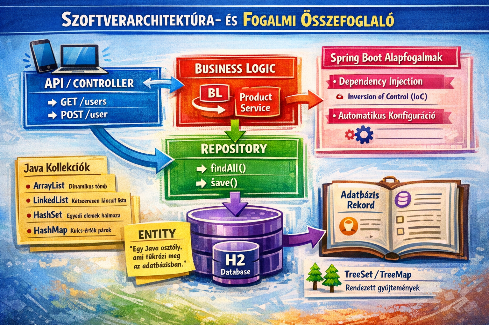
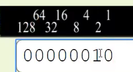
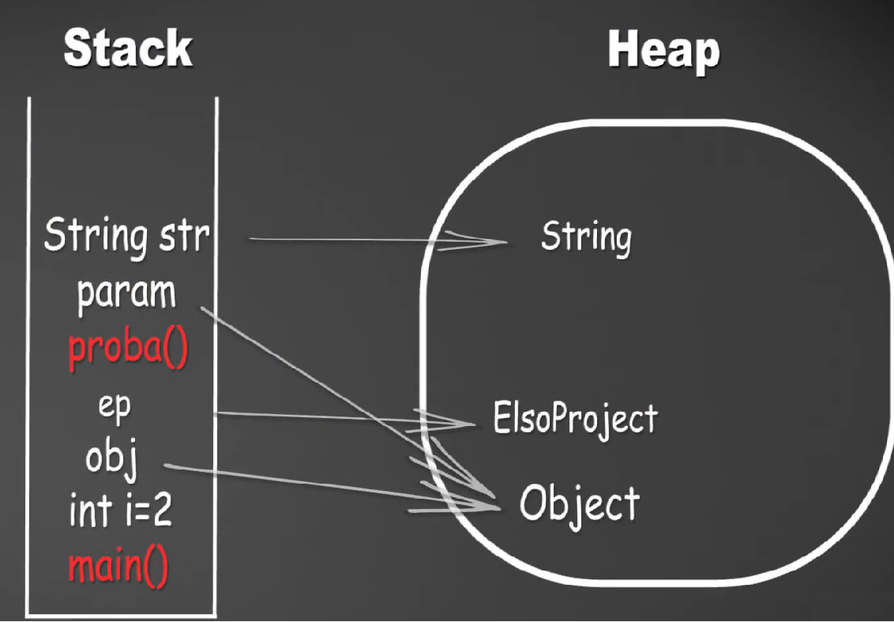
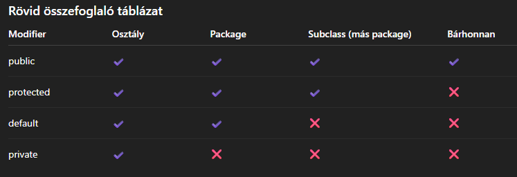
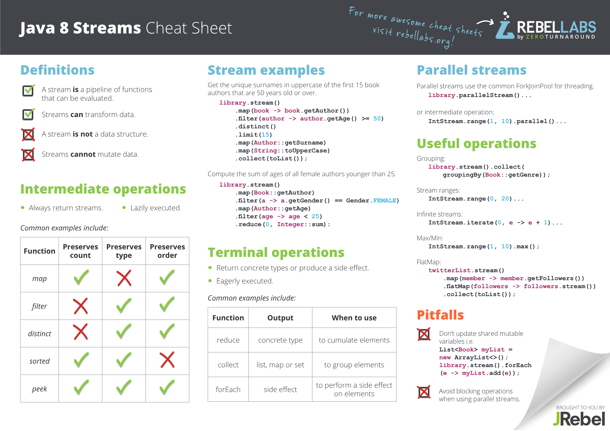
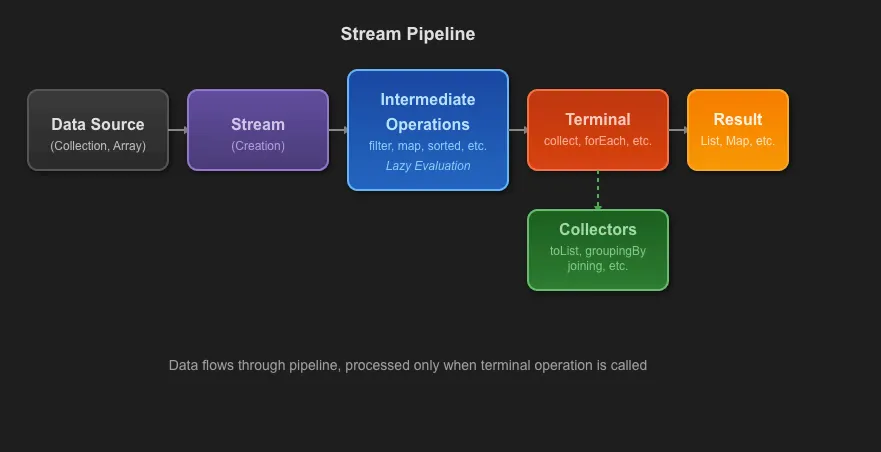

# Programozás Java nyelven

Útmutató, hogyan legyél programozó:

1. Nézz meg egy gyorstalpaló tananyagot.
2. Készíts el 3 darab irányított (guided) projektet.
3. Készíts egy saját projektet minden segítség nélkül.

Ez a jegyzet a Java programozási nyelv legfontosabb alapfogalmait foglalja össze tanulási célból.

A dokumentum bemutatja:

- a Java működésének alapjait (JVM, fordítási folyamat),
- az alapvető adattípusokat,
- az objektumorientált programozás (OOP) fő elveit,
- a metódusok, osztályok, konstruktorok és öröklődés használatát,
- valamint néhány gyakori programozási és állásinterjús kérdést.

A cél, hogy egy átlátható, gyakorlatorientált összefoglalót adjon a Java alapjairól, amely segíti a tanulást és a gyors ismétlést.

# Tartalomjegyzék

[Programozás Java nyelven](#programozás-java-nyelven)
- [Programozás Java nyelven](#programozás-java-nyelven)
- [Tartalomjegyzék](#tartalomjegyzék)
- [Források](#források)
- [Általános infók](#általános-infók)
  - [Java fordítási és futtatási folyamat](#java-fordítási-és-futtatási-folyamat)
- [Fejlesztői környezet](#fejlesztői-környezet)
  - [Visual Studio Code](#visual-studio-code)
  - [Eclipse](#eclipse)
    - [Eclipse további beállítás:](#eclipse-további-beállítás)
    - [Java technológiai áttekintés és működés](#java-technológiai-áttekintés-és-működés)
  - [Netbeans](#netbeans)
  - [IntelliJ IDEA](#intellij-idea)
- [Projekt importálása VS Code-ban](#projekt-importálása-vs-code-ban)
- [Adattípusok](#adattípusok)
  - [Primitív adattípusok](#primitív-adattípusok)
  - [Összetett adattípusok (referencia típusok)](#összetett-adattípusok-referencia-típusok)
  - [Pontosan hogyan tárolódnak a változók a memóriában](#pontosan-hogyan-tárolódnak-a-változók-a-memóriában)
- [Objektum orientált programozás (OOP)](#objektum-orientált-programozás-oop)
  - [Metódusok](#metódusok)
  - [NetBeans](#netbeans-1)
  - [VS Code](#vs-code)
  - [This](#this)
  - [Példák](#példák)
    - [Első és második példa:](#első-és-második-példa)
  - [Háromoperandusú Operátor](#háromoperandusú-operátor)
  - [Javadoc](#javadoc)
  - [Logika](#logika)
  - [Polimorfizmus (Többalakúság)](#polimorfizmus-többalakúság)
  - [Öröklés és Override](#öröklés-és-override)
  - [Interfész](#interfész)
  - [Konstruktor](#konstruktor)
    - [Első módszer a név megváltoztatására:](#első-módszer-a-név-megváltoztatására)
    - [Második módszer a név megváltoztatására:](#második-módszer-a-név-megváltoztatására)
    - [Harmadik módszer a név megváltoztatására:](#harmadik-módszer-a-név-megváltoztatására)
    - [Negyedik módszer a név megváltoztatására:](#negyedik-módszer-a-név-megváltoztatására)
    - [Overloading (túlterhelés)](#overloading-túlterhelés)
  - [Super](#super)
  - [OOP alapelve](#oop-alapelve)
- [Ismétlés és könnyű állásinterjús kérdések](#ismétlés-és-könnyű-állásinterjús-kérdések)
  - [Konkatenáció](#konkatenáció)
    - [Becsapós kérdés](#becsapós-kérdés)
    - [2. Becsapós kérdés](#2-becsapós-kérdés)
  - [Sortörések](#sortörések)
  - [Lefut-e?](#lefut-e)
  - [Explicit cast (szűkítés)](#explicit-cast-szűkítés)
  - [Overflow (Túlcsordulás)](#overflow-túlcsordulás)
  - [Típuskonverzió szabály](#típuskonverzió-szabály)
    - [double → int szűkítő (narrowing) konverzió](#double--int-szűkítő-narrowing-konverzió)
  - [Változónevek szabályai](#változónevek-szabályai)
- [Kasztolás](#kasztolás)
    - [Helyes megoldások char → String konvertálásra](#helyes-megoldások-char--string-konvertálásra)
- [Java dátum és idő kezelés (java.time)](#java-dátum-és-idő-kezelés-javatime)
  - [Rövid cheat sheet](#rövid-cheat-sheet)
- [Math()](#math)
- [Wrapper (burkoló) osztályok](#wrapper-burkoló-osztályok)
    - [Fordítási hiba ≠ futási hiba](#fordítási-hiba--futási-hiba)
- [Stack, Heap és Garbage Collector](#stack-heap-és-garbage-collector)
  - [Stack](#stack)
  - [Heap](#heap)
  - [Garbage Collector (Szemétgyűjtő)](#garbage-collector-szemétgyűjtő)
- [Környezet változók és a manuális fordítás](#környezet-változók-és-a-manuális-fordítás)
- [Véletlen mondat generátor készítés](#véletlen-mondat-generátor-készítés)
- [Tömb vs. ArrayList](#tömb-vs-arraylist)
  - [Tömb (Array)](#tömb-array)
    - [Tömb értékadása](#tömb-értékadása)
      - [Deklarálás + értékadás egy sorban](#deklarálás--értékadás-egy-sorban)
      - [Deklarálás külön, értékadás később](#deklarálás-külön-értékadás-később)
      - [Méret megadása, majd elemenkénti értékadás](#méret-megadása-majd-elemenkénti-értékadás)
      - [Tömb újraértékadása (felülírás)](#tömb-újraértékadása-felülírás)
      - [Értékadás ciklussal](#értékadás-ciklussal)
  - [ArrayList](#arraylist)
- [Az ArrayListek és a szülők kapcsolata](#az-arraylistek-és-a-szülők-kapcsolata)
  - [ArrayList használata az örökléssel](#arraylist-használata-az-örökléssel)
  - [Osztály kasztolása](#osztály-kasztolása)
  - [Object ősosztály használata](#object-ősosztály-használata)
  - [Hibás kód és futásidőben kivételt fog dobni](#hibás-kód-és-futásidőben-kivételt-fog-dobni)
- [Mit hagyott ránk az Object?](#mit-hagyott-ránk-az-object)
  - [instanceof](#instanceof)
  - [toString()](#tostring)
- [Immutable, Final és Static](#immutable-final-és-static)
  - [Immutable](#immutable)
    - [Mikre figyelj egy immutable class létrehozásakor!](#mikre-figyelj-egy-immutable-class-létrehozásakor)
  - [final](#final)
- [static](#static)
  - [static metódus](#static-metódus)
    - [static osztály](#static-osztály)
    - [static változó](#static-változó)
- [Diagramok és Kapcsolatok](#diagramok-és-kapcsolatok)
  - [Diagramok](#diagramok)
    - [„Is-a” kapcsolat (öröklés – inheritance)](#is-a-kapcsolat-öröklés--inheritance)
    - [Has-a” kapcsolat (összetétel / tartalmazás)](#has-a-kapcsolat-összetétel--tartalmazás)
- [Kivételek kezelése - Try Catch Finally](#kivételek-kezelése---try-catch-finally)
  - [Throwable (Előfordulható hibák/Elkapható problémák)](#throwable-előfordulható-hibákelkapható-problémák)
    - [Error (Hiba)](#error-hiba)
    - [Exception (Kivétel)](#exception-kivétel)
      - [Exception-n belül: Checked Exceptions (ellenőrzött kivételek)](#exception-n-belül-checked-exceptions-ellenőrzött-kivételek)
      - [Exception-n belül: Unchecked Exceptions (ellenőrzés nélküli kivételek)](#exception-n-belül-unchecked-exceptions-ellenőrzés-nélküli-kivételek)
  - [Példák](#példák-1)
    - [Checked Exceptions](#checked-exceptions)
    - [Unchecked Exceptions](#unchecked-exceptions)
    - [Eldobjuk a hibát](#eldobjuk-a-hibát)
- [Inner és Anonim Class](#inner-és-anonim-class)
- [Adatbekérés a felhasználótól](#adatbekérés-a-felhasználótól)
- [Példák](#példák-2)
  - [Elágazások](#elágazások)
  - [For ciklus és tömbök, valamint kasztolás](#for-ciklus-és-tömbök-valamint-kasztolás)
  - [Switch-case](#switch-case)
    - [Másik megoldás (Java 14+ switch expression és do-while)](#másik-megoldás-java-14-switch-expression-és-do-while)
  - [Do-while és if elágazás](#do-while-és-if-elágazás)
- [Java Dinamikus weboldal létrehozása](#java-dinamikus-weboldal-létrehozása)
- [Gyakorlás gyakorlás gyakorlás](#gyakorlás-gyakorlás-gyakorlás)
- [Map](#map)
  - [Főbb különbségek összefoglalva](#főbb-különbségek-összefoglalva)
  - [1. HashMap](#1-hashmap)
  - [2. LinkedHashMap](#2-linkedhashmap)
  - [3. TreeMap](#3-treemap)
    - [Melyiket válaszd?](#melyiket-válaszd)
  - [Mit használj a vizsgán?](#mit-használj-a-vizsgán)
- [Java Példák és Magyarázatok](#java-példák-és-magyarázatok)
  - [1. Fájlbeolvasás](#1-fájlbeolvasás)
  - [2. Fájlkiírás](#2-fájlkiírás)
  - [3. Stream műveletek](#3-stream-műveletek)
  - [4. HashMap példák](#4-hashmap-példák)
  - [5. Összefoglaló adatszerkezetek és alapok](#5-összefoglaló-adatszerkezetek-és-alapok)
  - [6. ArrayList kiíratás](#6-arraylist-kiíratás)
- [Printf](#printf)
  - [Mi az a printf?](#mi-az-a-printf)
  - [Formázó jelek (%)](#formázó-jelek-)
  - [Lebegőpontos szám (%f)](#lebegőpontos-szám-f)
  - [Tizedesjegyek megadása](#tizedesjegyek-megadása)
  - [Táblázatos kiírás](#táblázatos-kiírás)
- [Java Stream API](#java-stream-api)
  - [Java Stream API Gyorssegéd](#java-stream-api-gyorssegéd)
    - [Rövidebb verzió](#rövidebb-verzió)
    - [Haladó verzió](#haladó-verzió)
  - [Stream pipeline (alap működés)](#stream-pipeline-alap-működés)
  - [map vs filter](#map-vs-filter)
  - [TOP 5 Stream művelet](#top-5-stream-művelet)
  - [Példák a használatra](#példák-a-használatra)
    - [1. Megszámolás](#1-megszámolás)
    - [2. Kiíratás](#2-kiíratás)
    - [3. Gyűjtés](#3-gyűjtés)
  - [Collectors.partitioningBy és groupingBy, parallelStream példákkal](#collectorspartitioningby-és-groupingby-parallelstream-példákkal)
  - [collect(groupingBy)+entrySet+filter példákkal](#collectgroupingbyentrysetfilter-példákkal)
  - [További példák magyarázatokkal](#további-példák-magyarázatokkal)
- [Java Stream – Gyakori vizsgacsapdák](#java-stream--gyakori-vizsgacsapdák)
  - [1. A Stream csak a lezáró műveletnél fut le (lazy evaluation)](#1-a-stream-csak-a-lezáró-műveletnél-fut-le-lazy-evaluation)
  - [2. A stream csak egyszer használható](#2-a-stream-csak-egyszer-használható)
  - [3. A forEach() lezáró művelet](#3-a-foreach-lezáró-művelet)
  - [4. peek() használata](#4-peek-használata)
- [Rövid összefoglaló](#rövid-összefoglaló)
- [Menü rendszer](#menü-rendszer)
- [enum](#enum)
  - [Példa használatra](#példa-használatra)
- [Debug](#debug)

# Források

[Sanfranciscoboljottem tananyag](https://sanfranciscoboljottem.com)                         
[SZTE - Programozás I. jegyzet](https://okt.inf.szte.hu/prog1/gyakorlat/eloadas/Java/objectsAndClasses/)        
[Stacks and queues](https://data-flair.training/blogs/stacks-and-queues-in-c/)          
[IT Szótár](https://itszotar.hu/jvm-java-virtualis-gep-mi-a-mukodese-es-mi-a-szerepe-a-java-kod-futtatasaban/)  
[Java Programozás Kezdőknek - SkillVersum](https://www.youtube.com/playlist?list=PL92V_WHHt2CnXaUIA9T2ww7peDK4lqmZj)                    
[Java Streams API Explained (with examples)](https://www.youtube.com/watch?v=2StXP1XaU04) 
[Java Streams and Collectors](https://medium.com/@code.wizzard01/java-streams-and-collectors-a-practical-guide-and-cheat-sheet-with-real-world-examples-67dcf84156b5)    
[Java programozási nyelv](https://richardkorom.hu/java/backend/bevezetes/)     

[Pályakezdő fullstack tutorial csomag](https://www.skillversum.com/note/view/c256d513dd9e6f970aa3daa5ded7496b38d01e78)

A sanfranciscoboljottem tananyag sorrendje:  
Programozási alapismeretek  
Git Alapismeretek  
Java alapismeretek  
SQL alapismeretek  
JavaFX alapismeretek  
JavaFX Középhaladó  
Java Középhaladó (Vagy esetleg a szerver után.)  
JDBC - Adatbázis kapcsolatok  
Java szerver  
Spring Boot Ismeretek  
Spring Boot Ismeretek II.

[Java Cheat Sheet](https://github.com/luankevinferreira/java-dev-cheat-sheet/tree/main)
[Java Streams and Collectors: A Practical Guide and Cheat Sheet with Real-World Examples](https://medium.com/@code.wizzard01/java-streams-and-collectors-a-practical-guide-and-cheat-sheet-with-real-world-examples-67dcf84156b5)


📌 Klasszikus full-stack webalkalmazás felépítés.

React ↔ Spring (REST, JSON),

Frontend: React (JavaScript)  
Backend: Spring Boot (Java)

A lenti kép magyarázata a Spring Boot kezdőknek szóló fájlban található. [Itt](https://github.com/Nagraggini/springboot-for-beginners/blob/main/HowToDoIt_Hungarian_version.md)



# Általános infók

A Java egy általános célú, objektumorientált programozási nyelv.
Több operációs rendszeren is futtatható (Windows, macOS, Linux stb.).

A Java nyelvet a Sun Microsystems fejlesztette ki, amelyet később az Oracle vásárolt fel.

A Java programok futtatását a JVM (Java Virtual Machine) teszi lehetővé, amely különböző operációs rendszereken is képes végrehajtani a Java bytecode-ot.

Több operációs rendszeren is lehet futtatni, pl.: windows, mac, linux.
A Sun Microsystem alkotta meg a javat. Később az Oracle vette meg a céget.
A JVM miatt a Java programok sok különböző operációs rendszeren futtathatók.
A JVM a Java bytecode-ot (.class fájlok) futtatja, amelyeket gyakran .jar fájlba csomagolnak. A windows/linux pedig futtatja a JVM-t.

## Java fordítási és futtatási folyamat

A Java egyik legfontosabb tulajdonsága a platformfüggetlenség. Ez azt jelenti, hogy egy programot egyszer kell megírni, és az különböző operációs rendszereken is futtatható.

Ez a tulajdonság a bytecode és a Java Virtual Machine (JVM) együttműködésének köszönhető.

A fordítás és futtatás lépései

```
Java forráskód (.java)
        ↓
javac fordító
        ↓
Bytecode (.class)
        ↓
Java Virtual Machine (JVM)
        ↓
Natív gépi kód (machine code)
```

1. Forráskód

A fejlesztő Java forráskódot ír (.java fájlok).
Ez ember által olvasható programkód.

2. Fordítás (javac)

A javac fordító lefordítja a Java forráskódot bytecode-ra.

- bemenet: .java
- kimenet: .class

A bytecode egy platformfüggetlen utasításkészlet, amelyet nem közvetlenül a processzor hajt végre.

3. Bytecode

A bytecode egy köztes kód, amelyet a JVM képes értelmezni.
A .class fájlokat gyakran .jar (Java Archive) fájlba csomagolják, ami több class fájlt és erőforrást tartalmazhat.

4. Futás a JVM-ben

A Java Virtual Machine (JVM) betölti és futtatja a bytecode-ot.

A JVM működése:
- betölti az osztályokat
- ellenőrzi a bytecode biztonságát
- végrehajtja a kódot

A végrehajtás két módon történhet:
- Interpreter – soronként értelmezi a bytecode-ot
- JIT (Just-In-Time) compiler – a gyakran futó kódrészeket natív gépi kóddá fordítja a gyorsabb futás érdekében

5. Natív gépi kód

A JVM az adott operációs rendszerhez és processzorhoz igazodó machine code-ot hoz létre, amelyet a CPU közvetlenül végrehajthat.

**Write Once, Run Anywhere**

A Java híres elve:
"Write once, run anywhere"

Ez azt jelenti:
- a programot egyszer kell lefordítani bytecode-ra
- minden platformon csak a JVM-nek kell léteznie

Például:
- Windows → Windows JVM
- Linux → Linux JVM
- macOS → macOS JVM

A bytecode mindenhol ugyanaz marad.

**Java környezet komponensei**

JDK – Java Development Kit

A JDK a Java fejlesztéshez szükséges teljes eszközkészlet.

Tartalmazza:
- javac (fordító)
- JRE
- fejlesztői eszközök

**JRE – Java Runtime Environment**

A JRE a Java programok futtatásához szükséges környezet.

Tartalmazza:
- JVM
- Java szabványos könyvtárak

**JVM – Java Virtual Machine**

A JVM egy virtuális futtatókörnyezet, amely:
- betölti az osztályokat
- végrehajtja a bytecode-ot
- kezeli a memóriát
- végzi a Garbage Collectiont

**A JVM szerepe**

A JVM nem csak a kód futtatásáért felelős.

Feladatai például:
- Class loading – osztályok betöltése
- Bytecode verification – biztonsági ellenőrzés
- Memory management – memória kezelése
- Garbage Collection – automatikus memóriatisztítás
- JIT fordítás – teljesítmény optimalizálása

A JVM tehát egy absztrakciós réteg a Java alkalmazás és a hardver között, amely elrejti a platformfüggő részleteket a fejlesztő elől.

# Fejlesztői környezet

## Visual Studio Code

Egy népszerű, ingyenes kódszerkesztő, amelyhez rengeteg bővítmény érhető el.

Részletes magyarázót a telepítéshez [itt](https://nagraggini-blog.onrender.com/#vscode_install) találsz.

Hasznos kiegészítők [itt](https://nagraggini-blog.onrender.com/#vscode_extension_list)

[Hotkeys](https://nagraggini-blog.onrender.com/#hotkeys_for_vscode)

## Eclipse

[Innen](https://www.eclipse.org/downloads/packages/release/2024-06/r]) töltsd le a csomagolt változatot (zip fájl). 

Ezt: Eclipse IDE for Enterprise Java and Web Developers [link](https://www.eclipse.org/downloads/download.php?file=/technology/epp/downloads/release/2024-06/R/eclipse-jee-2024-06-R-win32-x86_64.zip)

A letöltött zip fájlt kicsomagoljuk, máris indítható az IDE.  
Első indításkor meg kell adni egy mappát (Workspace), ahová a projektek kerülnek. Munkaterületeket váltogathatunk: File/Switch workspace

Eclipse egyik furcasága, hogy alapból nem tudunk nyitó kapcsos zárójelet írni (Alt+b), csak akkor, ha kikapcsoljuk a gyorsbillentyű hozzárendelést:
Window/Preferences/General/Keys (vagy keresőben:”bind”)
Szűrjünk „alt+b”-re és mindkét bejegyzésnél „Unbind command”
Apply and close

### Eclipse további beállítás:

Window/Preferences/General/Editors/Text Editors:
pipáljuk be a Show Line numbers opciót

New Project -> Java Project ->
Configure JRE-s: "Use default JRE 'jdk-25.0.1' and workspace compiler preferences"
Vedd ki a pipát -> "Create module-info.java file"

Bal szélén a projekten jobb klikk package.

Billentyű parancsok:
Ha elfelejtjük a main-t, akkor Main + ctrl+space
ctrl+7 kommentjel
kitesz/visszavesz ctrl+shift+o: Importok fixálása, valamint a nem használtakat törli.
ctrl+shift+f Formázás
syso + ctrl +space Egyes verziókban: sout 2x ctrl +space
F11 Futtatás

Eclipse beállítása:
TO DO komment kikapcsolása Eclipse-ben

Window → Preferences

Menj ide:
Java → Code Style → Code Templates

A jobb oldalon keresd meg:

Code → Method body

Jelöld ki → Edit

Töröld ki ezt a sort:

// TO DO Auto-generated method stub

OK → Apply and Close

### Java technológiai áttekintés és működés

Platformok:
Java SE Standard Edition: általános célú platform.
Java EE - Enterprise Edition: elosztott, hibatűrő rendszerek fejlesztéséhez.
Jakarta EE - JE-nek 2017-től az Eclipse Foundation általi fejlesztése.

JAVA EE8 (2017) óta Jakarta EE a neve. Az Oracle átadta a specifikációt az Eclipse Foundationnek.

Futtató környezet:
JRE - Java Runtime Enviroment

Fejlesztői környezet:
DK - Java Development Kit

JVM – Java Virtual Machine: virtuális gép

Munkafolyamat forráskódtól futtatásig:
.java → javac .class JVM → platformfüggetlen futtatás

## Netbeans

netbeans+java-t töltsd le. -> Java EE változat kell. Tomcat-t rakd fel, a glasfish-t ne.

Java SE (Standard Edition): asztali alkalmazásokat lehet benne készíteni.

Java EE (Enterprise Edition): Céges környezet. Szerverek készítésehez jó.

Java FX: Segít szép grafikus környezetet létrehozni. Java Swing (régebbi) és Effect alkalmazások.

A netbeans telepítés végén a jobb alsó sarokban felajánl pár plugin-t, azokat telepítsd.

## IntelliJ IDEA

# Projekt importálása VS Code-ban

1. Futtatás ellenőrzése

Nyomd meg az F5-öt a projekt futtatásához.
Ha a projekt piros minden ellenére is a "Clean" után:
- Ellenőrizd, hogy a bal oldali sávban a "Java Projects" fül alatt látszanak-e a forrásfájlok (src).
- Ha nem látszanak, a VS Code nem projektként kezeli a mappát, csak sima fájlokként.

2. JDK verzió problémák

Ha a kód mindenhol piros, lehet, hogy a VS Code nem találja a telepített Java JDK-t.

Megoldás:
- Nyomd meg Ctrl + Shift + P.
- Írd be: "Java: Configure Java Runtime".
- Válaszd ki a megfelelő JDK-t.

# Adattípusok

## Primitív adattípusok

8 féle primitív adattípus létezik, mindent kis betűvel kell írni programozáskor.
A megadott memóriát fogja lefoglalni a változó, hiába nincsen benne semmi.
A Java statikusan típusos nyelv, meg kell adni, hogy a változó szám, vagy szöveg stb formátumú.

**byte**

Egész szám.
Tartomány: -128 - 127
Foglalt memória: 1 Byte=8 Bit
Alapértéke: 0

**short**

Egész szám.
Tartomány: -32 768 - 32 767
Foglalt memória: 2 Byte
Alapértéke: 0

**int**

Egész szám.
Tartomány: -2 milliárd - 2 milliárd
Foglalt memória: 4 Byte
Alapértéke: 0

**long**

Egész szám.
Tartomány: −9 223 372 036 854 775 808 – 9 223 372 036 854 775 807
Pontos magyar elnevezés:
9 kvintillió 223 kvadrillió 372 trillió 36 billió 854 milliárd 775 millió 808
Foglalt memória: 8 Byte
Alapértéke: 0

**float**

Lebegőpontos szám (egyszeres pontosság).
Tartomány: ≈ 1.175494 × 10⁻³⁸ - ≈ 3.402823 × 10³⁸
Foglalt memória: 4 Byte
Alapértéke: 0.0f

**double**

Törtszám szám (kétszeres pontosság).
Tartomány: 2.2250738585072014 × 10⁻³⁰⁸ - 1.7976931348623157 × 10³⁰⁸
Foglalt memória: 8 Byte
Alapértéke: 0.0d

**char**

Egy karakter.
Tartomány: 1 karakter (0–65 535)
Foglalt memória: 2 Byte
Alapértéke: '\u0000'

**boolean**

Logikai.
Tartomány: true/false
Foglalt memória: a JVMre bízza (technikai okokból nem fix).
Alapértéke: false

Röviden:
byte = 1 byte
short = 2 byte
char = 2 byte
int = 4 byte
float = 4 byte
double = 8 byte
long = 8 byte
boolean = A JVMre bízza.

## Összetett adattípusok (referencia típusok)

Ezek objektumok, a heap memórián tárolódnak, és nagy kezdőbetűvel íródnak:
String → karakterlánc (objektum)
Array (pl. int[])
List, Map, Set
saját osztályok

Az alapértelmezett értékük: **null**
Sok függvény megvan hozzájuk írva. pl.: .Length()

## Pontosan hogyan tárolódnak a változók a memóriában

[Decimal to Binary Converter](https://www.binaryhexconverter.com/decimal-to-binary-converter)

2 decimális = 10 bináris

1 byte = 8 bit, tehát 0–255 közötti egész számot lehet vele ábrázolni előjel nélküli (unsigned) formában.

Ha a byte előjeles (signed), akkor a tartománya –128…+127.

A lentiképen látszik, hogy a felső fekete hátterű értékeket kell megszorozni az alattuk lévőkkel.



# Objektum orientált programozás (OOP)

Távoli példa: Két nyelv. Az angol 8 betűvel, a magyar 5 betűvel fejezi ki ugyanazt.

You `drink`. | Isz`ol`.

Következő példa:
Készítünk egy játékot, melyben van fű is. Leprogramozzuk a fűszálat és valahányszor szükségünk van rá elég a fűszál osztályt meghívni. Minden tulajdonsága benne lesz, pl a mozgása, felszíne.

Harmadik példa:
Kocsmát építünk egy játékban.
Leprogramozzuk a padlót, a pultot, ezeket bármikor meghívhatjuk újra. Mindegyik entitás, a java-ban objektum.

Osztály (tervrajz) -> Objektum (A belőle készült példány.) Még egy objektum.

Utána készítsük el az Firstproject nevű package-t.

A NetBeans-ben alapvetően megtalálható a java compiler a program fordításához.

## Metódusok

void= Nincs visszatérési értéke.

String Fuggveny() {return null;} = Van visszatérési értéke.

Ökölszabály: Osztályon belül statikus metódusból nem hívhatunk meg nem statikus metódust.

## NetBeans

Jobb egér gomb a kódban és Insert code -> Getter és Setter.
Encapsulate Fields-t, ha bepipálod és elfelejtetted privátra állítani a változót, akkor ezt kijavítja.

## VS Code

A változon nyomsz egy jobb klikket és source action-n belül lesz a konstruktor létrehozása opció.

## This

Miért nem másolódnak a metódusok minden objektumba?

Ha minden objektum saját példányban tartalmazná az összes metódusát, az valóban pazarló lenne memóriában. Ehelyett a legtöbb objektumorientált nyelv ezt csinálja:

- Az **adatok (mezők, attribútumok)** objektumonként külön vannak.

- A **metódusok** közösek (osztályhoz vagy prototípushoz tartoznak).

Így egy metódusból egyetlen példány létezik, amit sok objektum használ.

De akkor honnan tudja a metódus, melyik objektummal dolgozzon?

👉 A **this** referencia miatt.

Amikor egy metódust egy objektumon keresztül hívsz meg, a rendszer automatikusan átadja azt az objektumot, amelyen a hívás történt.

Ez történik a háttérben:

    obj.metodus(param1, param2)
    ↓
    metodus(obj, param1, param2)   // a this = obj

Ez az általad említett „titkos paraméter”.

## Példák

### Első és második példa:

```java
package firstproject;

//Az osztálynevet mindig nagy betűvel kezd.
public class FirstProject {

//Ökölszabály: Osztályon belül statikus metódusból nem hívhatunk meg nem statikus metódust.
public static void main(String[] args) {
//String result = censor("A kutya nagyon aranyos kutya.", "kutya", "macska");
// System.out.println(result);

        //Új sablont hozok létre, példányosítom.
        Human first = new Human();

        first.setName("J"); //Beállítjuk a konstruktorral.
        System.out.println(first.getName()); //Lehívjuk a konstruktoral.
        first.writeMyName();

        Human second = new Human();
        System.out.println(second.getName());
    }

    // Metódus.
    // Ha nem írod oda a hozzáférési módosítót, akkor package-private (default) lesz.
    // Ez azt jelenti, hogy csak ugyanabban a package-ben érhető el.
    // void = nincs visszatérési értéke.
    // String fuggveny() { return null; } = van visszatérési értéke.
    // A zárójelben a paraméterek (argumentumok) vannak.
    public static String censor(String text, String toChange, String newWord) {

        if (text.contains(toChange)) {
        }

        text = text.replaceAll(toChange, newWord); // (keresett szó, új szó)

        return text;
    }

}
```

---

```java
package firstproject;

//Sablon. Blueprint.
public class Human {

    //Oszály változó, nem tartozik konkrét függvényhez.
    //Privátra kell állítani, hogy a Main-ből ne lehessen elérni.
    private String name = "Gy";
    private int age;

    //Metódus, aminek nincs visszatérési értéke, de kiírja az értéket.
    void writeMyName() {
        System.out.println(name);
    }

    /*A getter és setter konstruktorok lényege, hogy ne tudjuk közvetlenül megváltoztatni a változó értékét. */
    public String getName() {
        return this.name; //this = Ez az osztály változó, amit fent privátként deklaráltál. Most épp a Human.
    }

    public void setName(String name) {
        this.name = name;
    }

    public int getAge() {
        return age;
    }

    public void setAge(int age) {
        this.age = age;
    }

}
```
---

## Háromoperandusú Operátor

```java
//Új sablont hozok létre, példányosítom.
Human first = new Human();
first.setName("Gy");
first.setAge(20);

        //Háromoperandusú Operátor (Ternary Operator)
        //Igaz ez ? Igen : Nem
        System.out.println(first.getName() == null ? "Nincs név" : "Van név.\n" + first.getName());
        /*
        if (first.getName() == null) {
            System.out.println("Nincs név.");
            System.out.println(first.getName());
        } else {
            System.out.println("Van. név.");
            System.out.println(first.getName()); //Lehívjuk a konstruktoral.
        }
         */
```

## Javadoc

Ezzel a jelöléssel meg fog jelenni a crtl+space-el a kommented a metódus meghívásakor.

/\*_ A getter és setter konstruktorok lényege, hogy ne tudjuk közvetlenül megváltoztatni a változó értékét. _/
public String getName() {
return this.name; //this = Ez az osztály változó, amit fent privátként deklaráltál. Most épp a Human.
}

## Logika

```java
        Human valami = new Human();
        String thing = "Alma";
        String thing2 = new String("Alma");
        System.out.println(thing + "\n" + thing2);
        System.out.println(thing.charAt(0)); //Az első karaktert adja vissza.
        thing.length(); //mérete, output: 4
```

## Polimorfizmus (Többalakúság)

A megírt kód újrafelhasználása, pl.: ha már létre van hozva az állat osztály, akkor azt lehet többször is használni.
Mindegyik osztály ősosztálya az Object.

```java
package firstproject;

//Öröklés. Így tudod használni az Animal osztály getter és setterjét.
//Nincsen többszörös öröklődés a java-ban, ebben a formában, csak hosszú többszörös örökléssel. pl.: Gerincesek -> NAgy macska -> Macska.
public class Cat extends Animal {

    public void meow() {
        System.out.println("MEOW!");
    }

}
```

Másik osztály-ban:

```java
    public static void main(String[] args) {
        Cat macska = new Cat();
        Cat macska2 = new Cat();

        //Azért false az értéke, mert nem az értéket, hanem a referenciákat hasonlítja össze, macska és macska2 két külön objektum a memóriában.
        System.out.println(macska.equals(macska2));
        macska.meow();

    }
```

## Öröklés és Override

Annotáció (annotation) egy metaadat, amivel osztályokat, metódusokat, változókat stb. jelölünk meg, és amit a fordító vagy futásidőben a program fel tud dolgozni.

```java
    @Override //Felülírás.
    public void makeSound() {
        System.out.println("MEOW!");
    }

}
```

Elérési módosítók:  
4 féle láthatóság van, amiből 3-hoz kapcsolódik kulcsszó (private, protected, public), az utolsó pedig az alapértelmezett eset, amire szokás package private-ként hivatkozni.

**Public:**
Nyilvános, bárhonnan el lehet érni.

**Protected:**  
A protected metódusokat, csak az örökléssel létrehozott osztályok használhatják.

**Abstract:**  
Az asbsztrakt osztályok nem példányosíthatók.  
Ezt nem lehet csinálni:

        abstract class Animal {}

        Animal állat =new Animal();

## Interfész

Minden interface alapból public abstract, ezért ez a kettő ugyanazt jelenti:

```java
    interface Pet {
        void play();
    }
```

és

```java
    interface Pet {
        public abstract void play();
    }
```

---

Ez egy nyilvántartás, hogy a háziállatoknak mi a képességük.

        abstract interface Pet {

            public void cuddle();

            public void sit();

            public void layDown();
        }

---

Implementáljuk a Pet interfészt, után kötelező felülírni a metódusokat.  
Jobb klikk a Cat szón és Source Action -> Override/Implement Methods... -> Válaszd ki a metódusokat.  
Fontos infó, hogy bármennyi infészt lehet implementálni, nincs megkötés mint az öröklésnél.

    public class Cat extends Animal implements Pet {

        @Override //Felülírás.
        public void makeSound() {
            System.out.println("MEOW!");
        }

        @Override
        public void cuddle() {          

        }

        @Override
        public void layDown() {     

        }

        @Override
        public void sit() {        

        }
    }

## Konstruktor

A konstruktor, csak egyszer hívható meg, amikor az objektum létrejön. Nincs meghatározva, hogy van-e visszatérési értéke, avagy nincs.  
A konstruktor neve megegyezik az osztályéval, ha nem hozod létre, akkor az IDE automatikusan létrehozza.  
Amikor létre jön az objektum, akkor automatikusan lefut.

### Első módszer a név megváltoztatására:

Main-ben:

    Cat macska = new Cat();
    macska.setName("G");

    System.out.println(macska.getName()); //output: G

### Második módszer a név megváltoztatására:

A privát változót nem éri el az öröklőtt osztály, ezért kell a protected.

    abstract class Animal {
        protected String name;
    }

---

    // Ez a konstruktor:
    public Cat() {
         this.name = "Cirmi";
    }

---

Main-ben:  
 //new Cat(); -> Rész a konstruktor.

        Cat macska = new Cat();
        System.out.println(macska.getName()); //output: Cirmi

### Harmadik módszer a név megváltoztatására:

Maradt privát a name változó és a setName metódus meghívásával módosítjuk a name értékét.

    public Cat() {
            this.setName("Dörmi");
        }

Main-ben:

        //new Cat(); -> Konstruktor.
        Cat macska = new Cat();

        System.out.println(macska.getName());

### Negyedik módszer a név megváltoztatására:

Többféle konstruktort is létre lehet hozni, de az alap üres konstruktort ebben az esetben neked kell külön létrehoznod.

    public Cat(String name) {
            this.setName(name);
        }

Main-ben:

        //new Cat(); -> Konstruktor.
        Cat macska = new Cat("Cirmos");

        System.out.println(macska.getName());

Másik konstruktor:

    public class Cat(){
        public Cat(String name,
                    int weight
            ) {
                this.setName(name);
                this.setWeight(weight);

            }
     }

Main-ben:

    Cat macska = new Cat("J", 5);

    System.out.println(macska.getName() + " " + macska.getWeight() + " kg");

### Overloading (túlterhelés)

Overloading akkor történik, amikor azonos nevű konstruktorok vagy metódusok vannak egy osztályban, de a paraméterlistájuk különbözik. Ugyanez igaz a metódusokra is.

**Mit jelent, hogy különbözik a paraméterlista?**

Legalább az egyiknek igaznak kell lennie:

- más paraméterszám, vagy

- más paramétertípus, vagy

- más sorrendű paramétertípus.

⚠️ A paraméternevek NEM számítanak, csak a típus és a sorrend!

## Super

Az első parancsnak kell lennie. A super mindig arra utal akitől öröklök.

    public class Cat extends Animal {

        public Cat() {
            //Az Animal konstruktorát hívja meg.
            super();

            //Az Animal osztály implementációját is meg lehet hívni. Ősosztály metódusát hívjuk meg.
            super.makeSound();
        }
    }

## OOP alapelve

Íme az OOP (Objektumorientált Programozás) négy alappillére, mindegyikhez egy rövid magyarázattal és egy-egy gyakorlati példával, hogy könnyen megjegyezhető legyen:

1. Encapsulation (Egységbezárás)
   Lényege: Az adatok (mezők) és az rajtuk végzett műveletek (metódusok) egy egységbe (osztályba) zárása, miközben az adatokhoz való közvetlen hozzáférést korlátozzuk (pl. private módosítóval).

Példa: Egy Bankszamla osztályban az egyenleg változó privát, így nem írható át kívülről tetszőlegesen, csak a befizet() vagy kivesz() metódusokon keresztül, amik ellenőrizni tudják a művelet érvényességét.

2. Inheritance (Öröklődés)
   Lényege: Lehetővé teszi, hogy egy osztály (gyerekosztály) átvegye egy másik osztály (szülőosztály) tulajdonságait és viselkedését, így elkerülhető a kódismétlés.

Példa: Van egy általános Jarmu szülőosztályod (aminek van sebesseg mezője), és ebből származtatod az Auto és Motor osztályokat, amik automatikusan megkapják a sebesség kezelését, de hozzáadhatnak saját extrákat.

3. Polymorphism (Többalakúság)
   Lényege: Egyazon metódushívás különböző módon viselkedhet attól függően, hogy milyen típusú objektumra hívjuk meg (gyakran interfészeken vagy felüldefiniáláson keresztül).

Példa: Van egy Allat osztályod hangotAd() metódussal. Ha a Kutya objektumra hívod meg, azt írja ki, hogy "Vau", ha a Macska objektumra, akkor azt, hogy "Miau" – a hívó kódnak viszont nem kell tudnia, pontosan milyen állattal dolgozik.

4. Abstraction (Absztrakció)
   Lényege: A lényeges jellemzők kiemelése és a belső megvalósítás részleteinek elrejtése; csak azt mutatjuk meg a külvilágnak, "mit" csinál az objektum, nem azt, hogy "hogyan".

Példa: Egy Kavefozo gombját megnyomod (interfész), és megkapod a kávét. Nem kell tudnod, pontosan hány bár nyomáson vagy milyen hőmérsékleten dolgozik belül a gép.

Bónusz: Interface vs. Abstract Class (Interjú kedvenc!)
Ez a két eszköz segíti az absztrakciót, de más a céljuk:

Interface: Egy "szerződés". Csak azt mondja meg, hogy egy osztálynak mire kell képesnek lennie (pl. Minden ami ehető, rendelkezzen egy egyel() metódussal). Egy osztály több interfészt is megvalósíthat.

Abstract Class: Egy "félkész sablon". Tartalmazhat közös kódot (megvalósított metódusokat) és absztrakt metódusokat is. Akkor használjuk, ha az osztályok között szoros "egyfajta" (is-a) kapcsolat van (pl. minden Kutya egy Allat).

# Ismétlés és könnyű állásinterjús kérdések

## Konkatenáció

    //Az ln csinál utána egy sortörést.
    System.out.println(1 + 1 + " a " + 1 + 1); //output: 2 a 11

Miért?

- Balról jobbra értékel.
- Amíg szám + szám → összeadás.
- Amint megjelenik a String, onnantól konkatenáció.

### Becsapós kérdés

    char first = 'a';
    int second = 2;
    String third = first; //❌ NEM fut le. A Java nem konvertál automatikusan primitív típust String-gé.
    String fourst = "" + first; //✅ Lefut.

    fourst = "" + second; //✅ Lefut.

Mi történik itt?

- "" → String
- +first → String konkatenáció
- A char automatikusan String - gé alakul.

A kasztolás külön fejezetben lesz szó a további módszerekről.

### 2. Becsapós kérdés

    char first = 'a';
    int second = 2;
    System.out.println(first + second); //output: 99

👉 first = 'a' → ASCII/Unicode érték: 97

## Sortörések

    //Az ln csinál utána egy sortörést.
    System.out.println("Ah"); //output: Ah és sortörés.

    System.out.print("a"); //Nincs sortörés.
    System.out.print("\n"); //Manuális sortörés.

## Lefut-e?

    int x = 22;
    byte b = x;

❌ Nem fut le. Mi a probléma?

int → 32 bites
byte → 8 bites (−128 … 127)

A Java nem engedi az automatikus (implicit) szűkítést, mert adatvesztés történhetne.

    byte b = 22;
    int x = b; //Így működik, mert az int sokkal nagyobb.

## Explicit cast (szűkítés)

    int x = 22;
    byte b = (byte) x;

✅ Lefordul
⚠️ A programozó felelőssége az adatvesztés.

## Overflow (Túlcsordulás)

    int x = 130;
    byte b = (byte) x;
    System.out.println(b); //output: -126

A byte tartománya túllépésre kerül → körbefordul.

## Típuskonverzió szabály

Szélesítés (widening) → automatikus

byte → short → int → long → float → double

Szűkítés

❌ nem automatikus
✅ csak cast-tal

### double → int szűkítő (narrowing) konverzió

    double d = 3.5;
    int i = d; //❌ Fordítási hiba.

    int i = (int) d;
    System.out.println(i); // Mindig a tizedespont jobb oldalát eldobja. output: 3

## Változónevek szabályai

📌 Változónév:

- nem kezdődhet számmal;
- kezdődhet betűvel, \_-al vagy $-al;
- camelCase ajánlott Java-ban, mert a változó és a függvényneveket kisbetűvel kezdjük.

Számmal soha nem kezdünk változó deklarálást.

    int 1stVariable; //❌ Nem jó!
    int st1Variable; //✅ Jó.

# Kasztolás

Az Object osztálytól örököli a metódusokat az osztályunk. pl.: .equals()

A primitívek speciálisak, az objektumok nem, azok minding ugyanúgy működnek.

### Helyes megoldások char → String konvertálásra

✅ 1. Konkatenáció (gyakori, egyszerű, inkább NE használd intrejún)

    String s = "" + first;

✅ 2. String.valueOf() (legbiztonságosabb)

    String s = String.valueOf(first);

✅ 3. Character.toString() (szabályos OOP megoldás)

    String s = Character.toString(first);

    //A Character örököl az Object osztálytól, de itt nem az Object toString() metódusa hívódik meg.
    //Hanem a Character.toString(char) statikus metódus.

# Java dátum és idő kezelés (java.time)

A Java 8 óta a dátum és idő kezelésére a java.time API csomagot használjuk.
Ez leváltotta a régi Date és Calendar osztályokat.

Előnyei:        
- immutable (nem módosítható objektumok)        
- biztonságosabb        
- könnyebb használni        
- jobban olvasható      

Legfontosabb osztályok

```java
| Osztály           | Mire használjuk |
| ----------------- | --------------- |
| LocalDate         | csak dátum      |
| LocalTime         | csak idő        |
| LocalDateTime     | dátum + idő     |
| Period            | dátum különbség |
| Duration          | idő különbség   |
| DateTimeFormatter | formázás        |
```
**LocalDate (dátum kezelés)**

A LocalDate év, hónap és nap tárolására szolgál.

**Aktuális dátum**

```java
LocalDate today = LocalDate.now();
System.out.println(today);
```

példa kimenet:
2026-03-15

**Dátum létrehozása**

```java
LocalDate date = LocalDate.of(2024, 5, 10);
System.out.println(date);
```

kimenet:
2024-05-10

*Év, hónap, nap lekérése*

```java
LocalDate date = LocalDate.now();


int ev = date.getYear();
int honap = date.getMonthValue();
int nap = date.getDayOfMonth();
```

**Dátum módosítása**

A LocalDate immutable, ezért minden művelet új objektumot ad vissza.

*Év módosítása*
```java
LocalDate ujDatum = date.withYear(2030);
```

*Nap hozzáadása*
```java
LocalDate ujDatum = date.plusDays(10);
```

*Nap kivonása
```java
LocalDate ujDatum = date.minusDays(5);
```

*Év hozzáadása*
```java
LocalDate ujDatum = date.plusYears(2);
```

*Dátum összehasonlítása*
```java
LocalDate d1 = LocalDate.of(2024, 5, 1);
LocalDate d2 = LocalDate.of(2025, 5, 1);

d1.isBefore(d2);  // true
d1.isAfter(d2);  //false
d1.isEqual(d2);  //false
```

**Két dátum különbsége**

A Period osztály segítségével számolhatjuk ki.

```java
LocalDate szuletes = LocalDate.of(2000, 3, 10);
LocalDate today = LocalDate.now();

Period kulonbseg = Period.between(szuletes, today);

System.out.println(kulonbseg.getYears());
```

Ez kiszámolja az életkort években.

```java
LocalTime (csak idő)
LocalTime time = LocalTime.now();

System.out.println(time);
```

példa:
18:45:21.123

**LocalDateTime (dátum + idő)**

```java
LocalDateTime now = LocalDateTime.now();

System.out.println(now);
```

példa:
2026-03-15T18:45:21

**Dátum formázása**

A DateTimeFormatter segítségével.

```java
LocalDate today = LocalDate.now();

DateTimeFormatter formatter =
        DateTimeFormatter.ofPattern("yyyy.MM.dd");

System.out.println(today.format(formatter));
```

kimenet:
2026.03.15

**Gyakori formátumok**

```java
| Formátum | Jelentés  |
| -------- | --------- |
| `yyyy`   | év        |
| `MM`     | hónap     |
| `dd`     | nap       |
| `HH`     | óra       |
| `mm`     | perc      |
| `ss`     | másodperc |
```

**Példa dátum + idő formázás**

```java
LocalDateTime now = LocalDateTime.now();

DateTimeFormatter formatter =
        DateTimeFormatter.ofPattern("yyyy.MM.dd HH:mm");

System.out.println(now.format(formatter));
```

példa kimenet

2026.03.15 18:45

**String → dátum**

```java
String datum = "2024-05-10";

LocalDate date = LocalDate.parse(datum);
Dátum → String
LocalDate date = LocalDate.now();

String text = date.toString();
```

**Tipikus Java feladatok**

Java vizsgákon gyakran kérik:
- aktuális dátum lekérése
- életkor számítása
- dátum összehasonlítása
- dátum formázása
- dátumhoz nap / év hozzáadása

## Rövid cheat sheet

```java
LocalDate.now();
LocalDate.of(2024,5,10)

date.getYear()
date.getMonthValue()
date.getDayOfMonth()

date.plusDays(5)
date.plusYears(1)

date.isBefore(d2)
date.isAfter(d2)

LocalDate.parse("2024-05-10")

date.format(DateTimeFormatter.ofPattern("yyyy.MM.dd"))
```

# Math()

A Math osztály matematikai műveletek és konstansok elérését biztosítja:
Használata  Math.<metódus() vagy konstans>;
Függvények:

abs(érték) // abszolút értékkel tér vissza
min(érték1, érték2) //két szám közül a kisebbel tér vissza

max(érték1, érték2)- két szám közül a nagyobbal tér vissza
sqrt(érték)- a szám négyzetgyökével tér vissza
pow(alap, kitevő)- az alap hatványkitevőre emelésével tér vissza
round(érték)- a legközelebbi egész számra kerekít
floor(érték) //Lefelé kerekítés, de nem levágás. p.l: -6.99 => -7 
//Felfelé kerekítés. Math.floor(6.99) => 6 //Nem csak kerekítés.
ceil(érték) // Felfelé kerekítés, mindig. 6.31 => 7 | -6.3 => -6

Konstansok:
Pi (3.141592653589793)
E (2.718281828459045)

Példák:

ceil: Visszaadja a legkisebb egész számot (double formában), ami nem kisebb, mint az érték.
Negatív számnál a felfelé kerekítés → az érték kevésbé negatív lesz.
6.31 -> 7.0
6.99 -> 7.0
-6.3 -> -6.0
-6.99 -> -6.0

floor: Visszaadja a legnagyobb egész számot (double formában), ami nem nagyobb, mint az érték.
Negatív számnál lefelé kerekít → az érték kisebb lesz.
6.99 -> 6.0
6.01 -> 6.0
-6.01 -> -7.0
-6.99 -> -7.0

# Wrapper (burkoló) osztályok

Java-ban a wrapper (burkoló) osztályok a primitív adattípusok objektum megfelelői.

Primitív típus → Wrapper osztály

boolean → Boolean  
byte → Byte  
short → Short  
int → Integer  
long → Long  
float → Float  
double → Double  
char → Character

Mire jók a wrapper osztályok?

- Objektumként kezelhetők (pl. kollekciókban: List, Map).
- Tartalmaznak hasznos metódusokat (pl. parseInt, valueOf).
- Lehetővé teszik az autoboxing / unboxing használatát.
- Könyebb velük bonyolultabb dolgokat elvégezni.

Példa (autoboxing)

    int x = 5;
    Integer y = x;      // autoboxing
    int z = y;          // unboxing

Példa az automatikus becsomagolásra.

    public static void main(String[] args) {
        int second = 2;

        test(second);
    }

    //A java automatikusan becsomagolja az int-et egy Integer objektumba, így lehet váltogatni, működik ugyanez fordítva is.
    public static void test(Integer c) {
        System.out.println(c);
    }

Példa a primitív és objektum másolásra:

Lemásolja az első értékét. **Primitív típus → érték másolódik.**

        int a = 1;
        int b = a; //
        b++;
        System.out.println(" a: " + a + " ; b: " + b);

Mindkét változó ugyanarra az objektumra mutat.  
setName("Fluffy") az egyetlen közös objektumot módosítja.

**Objektumoknál nem az objektum másolódik, csak a memóriacím(referencia).**

        Cat macska = new Cat(); //macska létrehoz egy Cat objektumot

        Cat macska2 = macska; //→ referencia másolása
        macska.setName("Fluffy");
        System.out.println(macska.getName() + " " + macska2.getName()); //output: Fluffy Fluffy

### Fordítási hiba ≠ futási hiba

❌ Fordítási hiba (compile-time error): A fordító (javac) nem tudja lefordítani a kódot. Pl.: hiányzik a pontosvessző, szintaktikai hiba.  
👉 A program el sem indul.

Példa:
double → int szűkítő (narrowing) konverzió  
Java nem engedi automatikusan az adatvesztéssel járó konverziót.

    double d = 3.5;
    int i = d; //❌ Fordítási hiba.

💥 Futási hiba (runtime error)  
👉 A program elindul, de futás közben elszáll.

Mikor történik?

- A kód szintaktikailag helyes.
- Logikai vagy környezeti probléma futás közben. pl.: 0-val való osztás.

Explicit kasztolás (cast)

    double d = 3.5;
    int i = (int) d;
    System.out.println(i); // Mindig a tizedespont jobb oldalát eldobja. output: 3

    System.out.println((int) 3.9);   // 3
    System.out.println((int) -3.9);  // -3

# Stack, Heap és Garbage Collector

A FIFO és LIFO adatszervezési elvek azt írják le, milyen sorrendben kerülnek ki az elemek egy tárolóból.

FIFO – First In, First Out „Aki először jött, először megy.”

LIFO – First In, Last Out „Aki először jött, utoljára megy.”  
Mint a nyomtatópapíroknál, ha eggyesével rakod be a papírokat a tárolóba. Íhy működik a verem, vagyis stack.


Példa:

    public class ElsoProject {
        public static void main(String[] args) {
            int i = 2;
            Object obj = new Object();
            ElsoProject ep = new ElsoProject(); //Osztály példányosítása.
            ep.proba(obj);

        }

        //Azért nem kell ide a static, mert példányosítottuk az osztályt.
        private void proba(Object param) {
            String str = param.toString();
            System.out.println(str); //Ennél a sornál már kikerült a lenti képen lévő proba, param és str a Stack-ből.
        }
    }

## Stack

Verem. Gyorsabb memória terület.

A Stack egy memóriaterület, ahol a program lokális változóit (int, double, boolean, stb.) és függvényhívások adatait tárolják.  
LIFO (Last In, First Out) elven működik – az utolsó elem, amit betettünk, az első, amit kiveszünk.

## Heap

Kupac.
A Heap a dinamikusan foglalt memória helye, ahová a program futás közben hoz létre objektumokat.

Maga az Objektum a Heapben tárolódik, a stack-ban, csak hivatkozunk rá.  
Minden, ami benne van egy osztályban az az objektum része, vagyis a Heap-ben tárolódik, az osztályváltozók (int, String) is.



Példa:

    public static void main(String[] args) {
        Object o1 = new Object();
        o1 = null;
        o1 = new Object(); //Ne ugyanaz, mint a két sorral feljebb lévő.

    }

    private void proba(Object param) {
    }

Mi történik?

- new Object()  
  → objektum létrejön a heapben

- o1  
  → hivatkozás, ami a stackben van (o1 = null;)  
  → a heapben lévő objektum címére mutat

## Garbage Collector (Szemétgyűjtő)

A Garbage Collector (GC) egy automatikus memória-kezelő mechanizmus, ami a Heap-en lévő, már nem használt objektumokat felszabadítja. Figyeli, hogy mely objektumokra már nincs hivatkozás (pl. minden változó, ami mutat rá, megszűnt). Eltávolítja ezeket a memória felszabadításához. Nem garantált azonnali felszabadítás.

# Környezet változók és a manuális fordítás

Új JDK letöltése [innen](https://jdk.java.net/25/?utm_source).

Win + S → "environment variables" → Edit the system environment variables.  
Itt láthatók a környezeti változók, amiket a géped használ.  
Kattints a Environment Variables… gombra.  
System variables alatt: kattints a New… gombra (vagy keresd a meglévőt, ha PATH-ról van szó).

Nyomj ráa Path-ra és add hozzá újként.

Például JDK beállításához:

- Variable name: JAVA_HOME
- Variable value: C:\Program Files\Java\jdk-25 (a te telepítési útvonalad szerint)

PATH módosítása (hogy a CMD felismerje a java és javac parancsokat):

Alatta lesz:

1. Keresd meg a Path változót → Edit → New → add:

    %JAVA_HOME%\bin

2. OK → OK → OK

3. CMD ellenőrzés

Nyisd meg a Command Prompt-ot (Win + R → cmd → Enter).

Írd be:

    java -version
    javac -version

Ha mindkettő verziót visszaad, sikeres a beállítás.

4. Java fájl futtatása

Navigálj a mappába:

    cd C:\útvonal\a\projektedhez

Futtasd:

    javac FajlNeve.java
    java FajlNeve

# Véletlen mondat generátor készítés

```java
    public class SentenceGenerator {

        public static void main(String[] args) {
            Game game = new Game();
            System.out.println(game.generator());
        }
    }

    public class Game {

        public String generator() {
            String[] firstWord = {"Nagyon jó", "Megbízható", "Érdeklődő", "Szorgalmas", "Türelmes", "Tökéletes"};
            String[] secondWord = {"megoldás", "lehetőség", "kivitelezés"};
            String[] thirdWord = {"neked!", "nekünk!", "mindenkinek!", "az egész világnak!"};

            int oneLength = firstWord.length;
            int secondLength = secondWord.length;
            int thirdLength = thirdWord.length;

            //Math.random() 0 0.999999 közötti számod ad vissza.
            int random1 = (int) (Math.random() * oneLength);
            int random2 = (int) (Math.random() * secondLength);
            int random3 = (int) (Math.random() * thirdLength);

            //0.1 - generátor X 5 = 0.5
            //0.9 - generátor X 5 = 4.5
            //Mivel az (int) kasztolás leveszi a tizedes utáni értéket.
            //0-4 köz9tt értéket kapunk visza.
            String sentence = firstWord[(int) (Math.random() * firstWord.length)] + " " + secondWord[random2] + " " + thirdWord[random3];

            return sentence;

        }
    }
```

# Tömb vs. ArrayList

## Tömb (Array)

A tömb statikus, ha törölsz belőle egy elemet, akkor sem megy össze és meg kell adni az elején, hogy mekkora lesz.

Példák:

    String[] simpleArray0;  //Deklaráció.
    simpleArray0 = new String[]{"alma", "körte"};  //Nem kötelező egyből inicializálni. alma= 0. elem, körte= 1. elem
    System.out.println(simpleArray0[2]); //Ilyenkor még nem jelez hibát, hanem majd futási időben fog.

A tömb nem univerzálisan a leggyorsabb megoldás – a hatékonyság mindig attól függ, milyen műveleteket kell végrehajtani és milyen gyakran.

Röviden:

- Olvasás index alapján → tömb nagyon gyors
- Beszúrás / törlés → tömb gyakran lassú
- Keresés kulcs alapján → hash alapú struktúra gyorsabb
- Dinamikusan változó adatmennyiség → lista vagy más adatszerkezet előnyösebb

👉 A jó megoldás kiválasztása mindig a feladat jellegétől, az adatmérettől és a használati mintától függ, nem önmagában az adatszerkezettől.

A tömb tud tárolni primitíveket.

### Tömb értékadása

#### Deklarálás + értékadás egy sorban

    String[] simpleArray0 = new String[]{"alma", "körte"};

#### Deklarálás külön, értékadás később

    String[] simpleArray0 = new String[2];
    simpleArray0 = new String[]{"alma", "körte"};

#### Méret megadása, majd elemenkénti értékadás

    String[] simpleArray0 = new String[2];
        simpleArray0[0] = "alma";
        simpleArray0[1] = "körte";

#### Tömb újraértékadása (felülírás)

    simpleArray0 = new String[] {"banán", "barack"};

#### Értékadás ciklussal

    for (int i = 0; i < tomb.length; i++) {
        simpleArray0[i] = "elem " + i;
    }

## ArrayList

Az ArrayList dinamikusan tudja változtatni a méretét és, csak objektumokat lehet bele rakni.
Fontos, hogy be kell importálni felül.

```java
    import java.util.ArrayList;

    ArrayList<String> list = new ArrayList<>();
        //Az array tudja változtatni a méretét.
        list.add("alma");
        list.add("körte");

        list.remove(0);
        System.out.println("0. elem: " + list.get(0));
        list.size(); //output: 1
```

Nem tud tárolni primitíveket, csak wrapper osztályokat.

Például:

    ArrayList<Integer> list = new ArrayList<>();
    list.add(2); //int-t át tud konvertálni Integerré.

A tömbök természetesen lehetnek többdimenziósak.

ArrayList esetén is létrehozható többdimenziós struktúra,
de ehhez egymásba ágyazott listákat kell használni.

    tomb[3][3];

# Az ArrayListek és a szülők kapcsolata

```java
    public static void main(String[] args) {

        //Nem primitíveket, hanem objektumokat tárol.
        //Cat egy osztály → referencia típus.
        ArrayList<Cat> cats = new ArrayList<>();
        //Java 7+ verzióban elég a jobb oldalon az üres <>, a típus öröklődik a bal oldalról.

        //Régebben be kellett írni a jobb oldalra a Cat-et.
        //ArrayList<Cat> cats = new ArrayList<Cat>();

        Cat sziamiau = new Cat("Sziamiau");
        cats.add(sziamiau); //Ha ezt nem adjuk meg, akkor üres lesz az ArrayList.

        //Elkerüljük az IndexOutOfBoundsException-t hibát.
        if (!cats.isEmpty()) { //Ha nem üres.
            //cats.get(0) → visszaadja az első Cat referenciát. output: firstproject.Cat@1f32e575
            System.out.println("Neve: " + cats.get(0).getName()); //output: Sziamiau
        } else {
            System.out.println("Üres az ArrayList.");
        }

    }
```

## ArrayList használata az örökléssel

Ez a kód jól illusztrálja a polimorfizmust:

- Az ArrayList típusát az ősosztály adja.
- A konkrét objektum lehet leszármazott (Cat).
- A Cat osztály metódusai nem lesznek elérhetőek.

```java
    public static void main(String[] args) {

                                  //ArrayList létrehozása az ősosztály típusával.
                                  //Animal az ősosztály, a Cat pedig egy leszármazott.
                                  //Tárol objektumokat, nem primitíveket.
                                  ArrayList<Animal> cats = new ArrayList<>();

                                  //Ez lehetséges, mert minden Cat egy Animal, az öröklés miatt.
                                  Cat sziamiau = new Cat("Sziamiau");
                                  cats.add(sziamiau);

                                  if (!cats.isEmpty()) { //Ha nem üres.
                                      //cats.get(0) → visszaad egy Animal referenciát, ami valójában Cat típusú objektumra mutat.
                                      System.out.println("Neve: " + cats.get(0).getName());
                                  } else {
                                      System.out.println("Üres az ArrayList.");
                                  }

    }
```

## Osztály kasztolása

Cat osztályban:

```java
public void purr() {
System.out.println("Dorombolok.");
}

    public static void main(String[] args) {
        //Polimorfizmus
        //cats listája Animal típusú referenciákat tárol.
        //Cat egy leszármazott osztály, ezért hozzáadható.
        //Az ArrayList viszont csak Animal referenciákat ismer,
        //így a Cat-hez speciális metódus (purr()) nem érhető el közvetlenül.

        ArrayList<Animal> cats = new ArrayList<>();
        Cat sziamiau = new Cat("Sziamiau");
        cats.add(sziamiau);

        //cats.get(0) visszaad egy Animal referenciát, ami valójában egy Cat objektum.
        //A kasztolás (Cat) lehetővé teszi, hogy a Cat-specifikus metódusokat meghívd.

        Cat cat = (Cat) cats.get(0);

        //Most már elérhető a Cat osztály saját metódusa (purr()), mert a referenciát Cat típusúvá alakítottuk.
        cat.purr(); //Dorombolok.
    }
```

## Object ősosztály használata

```java
    public static void main(String[] args) {
        ArrayList<Object> cats = new ArrayList<>();
        Cat sziamiau = new Cat("Sziamiau");
        cats.add(sziamiau);

        Cat cat = (Cat) cats.get(0);
        cat.purr(); //Dorombolok.
    }
```

## Hibás kód és futásidőben kivételt fog dobni

```java
    public static void main(String[] args) {
        ArrayList<Object> cats = new ArrayList<>();
        Dog morzsa = new Dog();
        Cat sziamiau = new Cat("Sziamiau");
        cats.add(sziamiau);
        cats.add(morzsa);

        Cat cat = (Cat) cats.get(0);

        //cats.get(1) egy Dog, nem lehet Cat típusra kasztolni.
        Cat cat2 = (Cat) cats.get(1);

        cat2.purr();
    }
```

# Mit hagyott ránk az Object?

```java
    public static void main(String[] args) {
        ArrayList<Cat> cats = new ArrayList<>();
        Cat sziamiau = new Cat("Sziamiau");

        Object o1 = new Object();
        Object o2 = new Object();
        Object o3 = o1;

        //Amikor összehasonlítunk két objektumot,
        //akkor gyakorlatilag a háttérben a két hashcode-t hasonlítjuk össze.
        System.out.println(o1.hashCode() + " " + o2.hashCode() + " " + o3.hashCode());
        //Egyedi azonosítószáma. output: 523429237 664740647 523429237

        System.out.println(o1.equals(o3)); // output: true

        System.out.println(sziamiau.getClass()); // output: class firstproject.Cat
    }
```

## instanceof

```java
    //Akkor fut le, ha az első elem példánya a Cat osztálnak.
        if (cats.get(1) instanceof Cat) {
            Cat cat = (Cat) cats.get(1);
            cat.purr();
        }
```

## toString()

```java
    public static void main(String[] args) {
        ArrayList<Animal> cats = new ArrayList<>();
        Cat sziamiau = new Cat("Sziamiau");
        cats.add(sziamiau);
        Dog morzsi = new Dog();

        Integer a = 2;

        String something = a.toString();
        System.out.println(a); // output: 2
        System.out.println(sziamiau.toString()); // output: firstproject.Cat@279f2327
    }
```

A fenti példa módosítása:
A Cat osztályban:

```java
    @Override
    public String toString() {
        return "Macska vagyok, a nevem: " + this.getName();
    }
```

A Mainben:

```java
    System.out.println(sziamiau.toString()); // output: Macska vagyok, a nevem: Sziamiau
```

# Immutable, Final és Static

## Immutable

Megváltoztathatatlan.

String: A String egy immutable class, vagyis megváltoztathatatlan és a Heap-en belül a String Poolban van tárolva.

Mi a különbség a lenti két inicializáció között?

Röviden: memóriahasználatban, objektumok számában és referencia-azonosságban különböznek.

```java
    String a = "Hello!"; // String Poolban lévő String objektumra mutat.
    /*
    ✔️ Mit történik itt?
    A "Hello!" egy String literál.
    A Java a literálokat a String Constant Poolban (String Pool) tárolja.
    A String Pool a Heap memórián belül található (Java 7 óta).
    Ha már létezne "Hello!" a poolban, akkor a arra a meglévő objektumra mutatna.
    */

    String c = new String("Hello"); // Heapben van.

    /*✔️ Mit történik itt?
    A "Hello" literál először bekerül a String Poolba (ha még nem volt ott).
    A new String("Hello") mindig létrehoz egy új String objektumot a Heapben, a poolon kívül.
    c erre az új objektumra mutat, nem a poolban lévőre.
    👉 Tehát:
    String Pool: "Hello"
    Heap (külön objektum): new String("Hello")
    */

    System.out.println(a == c); //== referenciát hasonlít; output: false
```

### Mikre figyelj egy immutable class létrehozásakor!

```java
//Final kulcszó legyen ott az osztály deklarálásakor.
public final class Dog extends Animal {

        //Legyen egy final változója.
        final private int size;

        //Konstruktor.
        public Dog() {
            size = 0;
        }

        //Konstruktor, amivel lehet a változó értékét beállítani és nem kell neki setter.
        public Dog(int size) {
            this.size = size;
        }
    }
```

## final

Ez egy immutable class. =Megváltoztathatatlan.
final: A Dog osztály nem terjeszthető ki. Nem lehet a kutyának alfaja.
A metódusait nem lehet felülírni, mert final az osztály.

```java
    public final class Dog extends Animal {

        //A final változó értékét nem lehet megváltoztatni.
        final private int size;

        public void bark() {
        }

        public Dog() {
            size = 0;
        }

        public Dog(int size) {
            this.size = size;
        }

        public void getSize() {
            System.out.println(size);
        }
    }
```

Main-ben:

```java
Dog dog1 = new Dog();
dog1.getSize(); // output: 0

        Dog dog2 = new Dog(5);
        dog2.getSize(); // output: 5
```

Ha kiterjeszthető lenne a Dog osztály, nem lenne final és írunk bele egy final metódust, akkor azt nem lehetne felülírni.

# static

## static metódus

Ha egy osztálynak van statikus metódusa, akkor az példányosítás nélkül meghívható, mert az osztályhoz tartozik, nem az objektumhoz.

pl.: Math.random();

Másik példa:
A Dog osztályos belül van:

```java
public static void bark() {
System.out.println("Bark");
}
```

Main-ben:

```java
    public static void main(String[] args) {
        Dog.bark(); // Nem kellett példányosítani az osztályt, mert a metódus statikus.
    }
```

### static osztály

Egy top-level osztályt nem lehet static-ként deklarálni, csak belső (inner / nested) osztály lehet static.

### static változó

A statikus változó: az osztályhoz tartozik minden példány közösen használja egyetlen példányban létezik.

Main-ben:

```java
public static void main(String[] args) {
Cat cat1 = new Cat();
Cat cat2 = new Cat();

        //Az objectCount az osztályhoz tartozik, nem az objektumhoz.
        //Ezért statikus változót mindig az osztály nevével érünk el.
        System.out.println(Cat.objectCount); //output: 2
    }
```

Cat osztály:

```java
    public class Cat extends Animal {

        //Ezzel megtudjuk számolni, hogy hány objektum készült el.
        // //Mindegyik példány osztozik ezen a statikus változón.
        public static int objectCount;

        //Konstruktor, ha nem hozod létre, akkor az IDE automatikusan létrehozza.
        //Amikor létre jön az objektum, akkor automatikusan lefut.
        public Cat() {
            objectCount++;

        }
    }
```

# Diagramok és Kapcsolatok

**Public:**  
Mindenhonnan elérhető (bármely package-ből, bármely osztályból).

**Protected:**  
 Elérhető azonos package-en belül (mint a default), más package-ből csak leszármazott (subclass) osztályból érhető el.

**Private:**  
 Csak az adott osztályon belül elérhető. Még a leszármazott osztály sem éri el.

**Abstact:**  
 Nem access modifier, hanem osztály/metódus jellemző. Nem lehet példányosítani, de kiterjeszteni lehet (extends).

**Default / package-private:**  
 Ha nincs kiírva. Csak az adott package-en belül elérhető, még subclass esetén sem. NEM protected.



## Diagramok

Létre lehet hozni UML, vagy osztály diagramot. Hasonlít egy adatbázis kapcsolati ábrára, de nem ugyanaz (viselkedést is mutat).

Has it. Vagy Is it. Nem mindegyik, hogy mi-miből van leszármaztatva.

### „Is-a” kapcsolat (öröklés – inheritance)

👉 Leszármazás.

Szabály:
A leszármazott osztály „egy fajta” a szülőből.

### Has-a” kapcsolat (összetétel / tartalmazás)

👉 Egy osztály tartalmaz egy másikat.

Szabály:
Az egyik objektumnak van egy másik objektuma.

# Kivételek kezelése - Try Catch Finally

## Throwable (Előfordulható hibák/Elkapható problémák)

A Throwable az összes eldobható objektum alapja a Java-ban.

Két fő típusa van:

### Error (Hiba)

Példa: OutOfMemoryError, StackOverflowError

Jellemzők:

- Súlyos problémák a JVM működésében.
- Nem kell kezelni, általában nem tudod helyrehozni a programból.
- Rendszer-szintű súlyos hibák, amiket az alkalmazás szinten általában nem kezelünk.
- Unchecked, runtime hiba.

### Exception (Kivétel)

- Példa: IOException, SQLException, NullPointerException

Két fő kategória:

#### Exception-n belül: Checked Exceptions (ellenőrzött kivételek)

Példa: IOException, FileNotFoundException

Jellemzők:

- Compile-time ellenőrzés → a fordító figyelmeztet, ha nem kezeled.
- Meg kell oldani: try-catch blokkal, vagy throws kulcsszóval tovább dobni.

Használati eset: amikor a hiba előre látható, pl. fájl olvasása, hálózati kommunikáció.

#### Exception-n belül: Unchecked Exceptions (ellenőrzés nélküli kivételek)

Példa: NullPointerException, ArrayIndexOutOfBoundsException

Jellemzők:

- Runtime exceptions → futásidőben jelentkeznek.
- Nem kötelező kezelni, a fordító nem kéri.

Használati eset: programhibák, logikai hibák, pl. nem inicializált változó használata.

## Példák

### Checked Exceptions

Első példa:

    try {
        byte a = 300;
        //Ha nem sikerül ezt lefuttatni, akkor az exception részre ugrik a program.
    } catch (Exception e) {
        System.out.println("Kivétel: " + e); //Kiíratjuk a hibaüzenetet.
    }

Második példa try-with-resources-os:

    public static void main(String[] args) {
        File file = new File("C://file.txt");
        try (//A try-catch-t automatikusan hoztam létre az IDE segítségével.
                // A FileReader sora eljén kattints a villanykörtére -> surround try-catch.
                FileReader fr = new FileReader(file)) {
        } catch (IOException e) {
            System.out.println(e);
        } finally { //A finally-t nem kötelező megadni.
            // Ez mindenképpen le fut, akár lefutott a try, vagy nem, akár lefutott a catch, vagy nem.
            // Ez mindenkéépen lefut.
            System.out.println("Mindenképpen ez ki lesz írva.");
        }
    }

### Unchecked Exceptions

ArrayIndexOutOfBoundsException

    int num[] = {1, 2, 3, 4, 5};
    System.out.println(num[6]);

NullPointerException

    Cat cat = new Cat();
    if (cat.getName().equals("Aladár")) {
    }

Ezzel is le lehet ellenőrizni, hogy egyenlőe nullával.

    if (cat != null && cat.getName() != null) {
        }

InputMismatchException

pl.: Számot kérünk be, de a felhasználó szöveget ad meg.

    if (sc.hasNextInt()) {
        grade = sc.nextInt();
    } else {
        System.out.println("Nem számot adtál meg!");
        sc.next();
    }

Vagy

    try{

    } catch (InputMismatchException e) {
        System.out.println("Nem számot adtál meg!");
        sc.next(); // hibás input eldobása
    }

### Eldobjuk a hibát

Ha egy kis rész programban nem szeretnéd lekezelni a hibát, akkor megteheted azt, hogy dobod.

Példa:

    import java.io.File;
    import java.io.FileNotFoundException;
    import java.io.FileReader;

    public class ElsoProject {

        //Ökölszabály: Osztályon belül statikus metódusból nem hívhatunk meg nem statikus metódust.
        public static void main(String[] args) {
            try {
                test();
            } catch (FileNotFoundException e) {                
                e.printStackTrace();
            }
        }

        private static void test() throws FileNotFoundException {
            File file = new File("C://file.txt"); //FileNotFoundException
            FileReader fr = new FileReader(file);
            //A FileReader sora eljén kattints a villanykörtére -> Add throws declaration

        }

# Inner és Anonim Class

# Adatbekérés a felhasználótól

import java.util.Scanner; //Import az osztály létrehozása előtt.

Scanner scanner = new Scanner(System.in); //Szkenner osztály példányosítása a használathoz.

String data=scanner.nextLine(); //Egy sor beolvasása.

scanner.nextDouble()
scanner.nextBoolean()
scanner.nextInt()

# Példák

## Elágazások

    System.out.println("Adj meg egy életkort, és írd kiírom, hogy kiskorú, felnőtt vagy nyugdíjas-e!");
    Scanner sc = new Scanner(System.in);
    int age = sc.nextInt();

    if (18 <= age && age < 65) {
        System.out.println("Felnőtt");
    } else if (age < 18) {
        System.out.println("Kiskorú");
    } else {
        System.out.println("Nyugdíjas");
    }

## For ciklus és tömbök, valamint kasztolás

    System.out.println("Adj meg három számot vesszővel elválasztva, és kiírom, melyik a legnagyobb!");
    Scanner sc = new Scanner(System.in);
    String numbers = sc.nextLine();

    String[] numbers2 = numbers.split(",");

    int max = Integer.parseInt(numbers2[0]); //Negatív számok esetén, nem jó a 0.

    for (int i = 0; i < numbers2.length; i++) {
        //Integer.parseInt() -> Kasztolás.
        //trim() -> Leszedi a szóközöket.
        max = Math.max(Integer.parseInt(numbers2[i].trim()), max);
     }

    System.out.println("A legnagyobb szám: " + max);

## Switch-case

A switch nem feltételeket, hanem konkrét értékeket vizsgál; tartományok ellenőrzésére if–else szerkezetet használunk.

    //Csak egyszer fut le.
    Scanner sc = new Scanner(System.in);
    System.out.println("Adj meg egy érdemjegyet (1-5-ig), \n és kiírom szövegesen az eredményt (elégtelen, jeles, stb).");

    //Leellenőrizzük, hogy tuti számot adott-e meg a felhasználó.
    if (sc.hasNextInt()) {
        int grade = sc.nextInt();

        switch (grade) {
            case 1:
                System.out.println("Elégtelen.");
                break;
            case 2:
                System.out.println("Elégséges.");
                break;
            case 3:
                System.out.println("Közepes.");
                break;
            case 4:
                System.out.println("Jó.");
                break;
            case 5:
                System.out.println("Jeles.");
                break;
            default:
                System.out.println("1 és 5 között adj meg egy számot.");
        }
        sc.close();

    } else {
        System.out.println("Nem számot adtál meg.");
    }

### Másik megoldás (Java 14+ switch expression és do-while)

    Scanner sc = new Scanner(System.in);
    int grade;

    do {
        System.out.print("Adj meg egy érdemjegyet (1–5): ");

        if (!sc.hasNextInt()) { //Nem számot adott meg a felhasználó.
            System.out.println("Nem számot adtál meg!");
            sc.next(); // hibás input eldobása
            grade = 0; // biztosan rossz érték
            continue; //Hagyd abba a ciklus aktuális körét, és ugorj a következőre.
        }

        grade = sc.nextInt();

        if (grade < 1 || grade > 5) {
            System.out.println("Hibás érték! 1 és 5 között add meg.");
        }

    } while (grade < 1 || grade > 5);

    // Java 14+ switch expression
    switch (grade) {
        case 1 ->
            System.out.println("Elégtelen."); //A break-t sem kell kiírni.
        case 2 ->
            System.out.println("Elégséges.");
        case 3 ->
            System.out.println("Közepes.");
        case 4 ->
            System.out.println("Jó.");
        case 5 ->
            System.out.println("Jeles.");
    }

    sc.close();

## Do-while és if elágazás

    Scanner sc = new Scanner(System.in);

        int number;

        do {
            System.out.println("Adj meg egy számot, ami 1 és 10 között van.");

            if (!sc.hasNextInt()) {
                System.out.println("Hibás érték, próbáld újra!");
                sc.next(); // hibás input eldobása
                number = 0; // A do-while végén a number értékét vizsgálom, ezért a fordító kötelezően
                            // inicializáltnak akarja látni.
                continue;// Ezzel nem csak egyszer dobja vissza a felhasználónak az újra beírás
                         // lehetőségét. Kiírja újra a do-while második sorát is.
            }
            // A vizsgálat után adjuk meg a változónak az értéket.
            number = sc.nextInt();

            // Logikai vizsgálat.
            if (number < 1 || number > 10) {
                System.out.println("Túl nagy vagy túl kicsi az érték. \n Újra!");
            }
        } while (number < 1 || number > 10);
        System.out.println("Jó a szám, 1 és 10 között van!");

# Java Dinamikus weboldal létrehozása

Első projekt létrehozásához [itt](https://www.youtube.com/watch?v=RAJI9GfPs2g) találod azt, ami alapján csináltam.

Eclipse IDE for Enterprise Java and Web Developers
Ha, csak Java Developer van az, se gond, akkor be kell állítani ezt:
Servlet API hozzáadása a projekthez manuálisan

Menj a Tomcat mappádba, pl. C:\apache-tomcat-9.0.80\lib

Ott találod: servlet-api.jar (és esetleg jsp-api.jar)

Eclipse-ben:

Jobb klikk a projektre → Properties → Java Build Path → Libraries → Add External JARs…

Tallózd be a servlet-api.jar-t → OK

Most már a import javax.servlet.\*; működni fog

Tomcat szervert [innen](https://tomcat.apache.org/download-10.cgi) tudod letölteni.
Binary -> Core verzió

Ha hiányzik a .class fájl a build mappából, akkor Eclipse -> Project → Clean

_Ha nem működik a servlet:_
Window → Show View → Servers
Alul megjelenik a szerver panel.
Tomcat v10.1 Server at localhost
→ Right click -> Clean ->Aztán Publish -> Aztán Restart.

Render.com-on Dockerrel kell deployolnod, mert Render nem tud közvetlenül WAR fájlokat futtatni Tomcat nélkül.

# Gyakorlás gyakorlás gyakorlás

[Gyakorló feladatok / Programozás részen](https://infojegyzet.hu/vizsgafeladatok/)

Az én megoldásaimat [itt](https://github.com/Nagraggini/start-projects/tree/main/java-console-exams/src) találod.

További feladatokat [itt](https://www.oktatas.hu/kozneveles/erettsegi/feladatsorok) találsz.

[Interaktív tesztek a programozáshoz](https://infojegyzet.hu/vizsgafeladatok/szoftverfejleszto-interaktiv/teszt/?tesztkod=K31G-MZYR)

# Map

## Főbb különbségek összefoglalva

```bash
| Tulajdonság         | HashMap                             | LinkedHashMap                                  | TreeMap                                               |
| ------------------- | ----------------------------------- | ---------------------------------------------- | ----------------------------------------------------- |
| **Sorrend**         | Nincs garantált sorrend.            | A hozzáadás sorrendjét követi.                 | Természetes sorrend (pl. ABC) vagy egyedi Comparator. |
| **Belső felépítés** | Hash tábla (Hashtable).             | Hash tábla + Duplán láncolt lista.             | Piros-fekete fa (Red-Black Tree).                     |
| **Gyorsaság**       | A leggyorsabb (O(1)).               | Kicsit lassabb a lista miatt, de gyors (O(1)). | Lassabb (O(log n)).                                   |
| **Null kulcs**      | Egy darab `null` kulcs megengedett. | Egy darab `null` kulcs megengedett.            | **Nem enged meg** `null` kulcsot (hibát dob).         |
```

---

## 1. HashMap

Ez a leggyakrabban használt Map. Akkor használd, ha a **teljesítmény a legfontosabb**, és egyáltalán nem számít, hogy az elemek milyen sorrendben jönnek ki belőle.

- **Működése:** Hashing technikát használ.
- **Előnye:** Nagyon gyors keresés, beszúrás és törlés.

## 2. LinkedHashMap

Olyan, mint a HashMap, de "emlékszik" arra, hogy milyen sorrendben adtad hozzá az elemeket.

- **Működése:** Fenntart egy duplán láncolt listát az elemek között.
- **Előnye:** Ha végigiterálsz rajta, pontosan abban a sorrendben kapod vissza az elemeket, ahogy betetted őket. Kiváló gyorsítótárak (cache) készítéséhez.

## 3. TreeMap

Ez a Map **mindig rendezve van**.

- **Működése:** Egy fa struktúrát épít fel.
- **Előnye:** Az elemeket automatikusan sorba rendezi a kulcsok alapján (például számoknál növekvő sorrend, szövegeknél ABC). Ha szükséged van arra, hogy a kulcsaid mindig rendezettek legyenek, ez a jó választás.

---

### Melyiket válaszd?

> - **HashMap:** Ha csak gyorsan akarsz tárolni és lekérdezni, és nem érdekel a sorrend.
> - **LinkedHashMap:** Ha fontos, hogy "ki volt az első", vagyis a hozzáadási sorrend számít.
> - **TreeMap:** Ha azt akarod, hogy a Map-ed mindig ABC vagy számszerinti sorrendben legyen.

**Egy fontos megjegyzés:** Mivel a `TreeMap` folyamatosan rendezi magát minden beszúrásnál, ez a leginkább erőforrás-igényes a három közül.

## Mit használj a vizsgán?

Beolvasás: Mindig olvass be egy ArrayList-be (ez az alap).

Keresés/Szűrés/Statisztika: Használd a listát és a Stream API-t.

Egyedi kulcsos keresés: Csak akkor készíts HashMap-et, ha a feladat kifejezetten kéri, hogy egy azonosító alapján keress ki valamit villámgyorsan.


# Java Példák és Magyarázatok

## 1. Fájlbeolvasás

```java
public void fajlBeolvasas(String fajlneve) {

    // Van amikor ez a jó: StandardCharsets.UTF_8
    // Van amikor ez a jó: Charset.forName("windows-1250")

    Path path = Path.of(fajlneve);

    // Ellenőrzés és beolvasás egyben
    if (!Files.exists(path)) {
        System.out.println("Nem létezik a fájl!\n Itt keresem: " + System.getProperty("user.dir"));
        return; // Ha nincs fájl, ne is menjünk tovább.
    }

    ArrayList<Operatorok2> lista = new ArrayList<>();

    try { // Vs code-ban: Katt a Standard-ra, majd sárga körte ikon -> Surround statemnt with try-catch.
        List<String> sorok = Files.readAllLines(path, StandardCharsets.UTF_8);

        //Van, amikor 1-től kell menni az oszlopnevek miatt.
        for (int i = 0; i < sorok.size(); i++) {
            String[] t = sorok.get(i).split(" ");

            lista.add(new Operatorok2(Integer.parseInt(t[0]), t[1], Integer.parseInt(t[2])));
        }
    } catch (IOException ex) {
        System.getLogger(Operatorok2.class.getName())
              .log(System.Logger.Level.ERROR, (String) null, ex);
    }
}
```

## 2. Fájlkiírás

```java
public void fajlKiiras() {
    // 1️⃣ Lista létrehozása
    ArrayList<Operatorok2> lista = new ArrayList<>();

    // 2️⃣ Példa adatok hozzáadása
    lista.add(new Operatorok2(10, "+", 5));
    lista.add(new Operatorok2(20, "-", 3));
    lista.add(new Operatorok2(4, "*", 6));

    try {
        // 3️⃣ Lista kiírása fájlba Stream segítségével
        Files.write(
            Path.of("eredmeny.txt"),
            lista.stream()
                 .map(Object::toString)
                 .toList(),
            StandardCharsets.UTF_8
        );

        System.out.println("Fájl kiírva: eredmeny.txt");

    } catch (IOException e) {
        System.out.println("Hiba történt a fájl írásakor.");
    }
}
```

## 3. Stream műveletek

```java
public void StreamFunkciok() {
                // Példa lista létrehozása
                List<Integer> szamok = Arrays.asList(5, 10, 15, 20, 25, 10, 5);

                // 1️⃣ Stream létrehozása a listából
                szamok.stream(); // Adatfolyammá alakítjuk a számoka.
                szamok.parallelStream(); // A feladatot több részre bontja és párhuzamosan a gép több prociján egyzserre
                                         // csinálja.

                // 2️⃣ Szűrés (Filtering)
                List<Integer> nagyobbMint10 = szamok.stream().filter(x -> x > 10) // csak a 10-nél nagyobb számokat
                                                                                  // tartjuk meg
                                .collect(Collectors.toList()); // visszaadjuk List-ként
                System.out.println("Számok > 10: " + nagyobbMint10);

                // 3️⃣ Ismétlődések eltávolítása
                List<Integer> distinctSzamok = szamok.stream().distinct() // eltávolítja az ismétlődő elemeket
                                .collect(Collectors.toList());
                System.out.println("Ismétlődés nélkül: " + distinctSzamok);

                // 4️⃣ Transzformálás (Mapping)
                List<Integer> szamokNegyzet = szamok.stream().map(x -> x * x) // minden számot négyzetre emelünk
                                .collect(Collectors.toList());
                System.out.println("Számok négyzete: " + szamokNegyzet);

                // 5️⃣ Rendezés
                List<Integer> rendezett = szamok.stream().sorted() // természetes sorrend (növekvő)
                                .collect(Collectors.toList());
                System.out.println("Rendezett számok: " + rendezett);

                // Egyedi comparator
                List<Integer> csokkeno = szamok.stream().sorted(Comparator.reverseOrder()) // csökkenő sorrend
                                .collect(Collectors.toList());
                System.out.println("Csökkenő sorrend: " + csokkeno);

                // 6️⃣ Limitálás és kihagyás
                List<Integer> elso3 = szamok.stream().limit(3) // csak az első 3 elem
                                .collect(Collectors.toList());
                System.out.println("Első 3 szám: " + elso3);

                List<Integer> kihagy3 = szamok.stream().skip(3) // az első 3 elem kihagyása
                                .collect(Collectors.toList());
                System.out.println("Az első 3 elem kihagyva: " + kihagy3);

                // 7️⃣ Feldolgozás / Iteráció
                System.out.print("Minden szám kiírása: ");
                szamok.stream().forEach(x -> System.out.print(x + " ")); // minden elemre művelet
                System.out.println();

                // 8️⃣ Aggregálás / Visszatérő érték
                long darab = szamok.stream().count(); // elemek számolása
                System.out.println("Összes szám: " + darab);

                boolean van10 = szamok.stream().anyMatch(x -> x == 10); // legalább egy 10-es van-e
                System.out.println("Van 10-es szám: " + van10);

                boolean mindenPozitiv = szamok.stream().allMatch(x -> x > 0); // minden szám pozitív-e
                System.out.println("Minden szám pozitív: " + mindenPozitiv);

                boolean nincs0 = szamok.stream().noneMatch(x -> x == 0); // egyik sem 0
                System.out.println("Nincs 0: " + nincs0);

                Optional<Integer> elso = szamok.stream().findFirst(); // első elem Optional-ként
                System.out.println("Első szám: " + elso.orElse(-1));

                Optional<Integer> barmelyik = szamok.stream().findAny(); // bármelyik elem Optional-ként
                System.out.println("Bármelyik szám: " + barmelyik.orElse(-1));

                // 9️⃣ Redukció
                int osszeg = szamok.stream().reduce(0, Integer::sum); // összegzés
                System.out.println("Összeg: " + osszeg);

                Optional<Integer> max = szamok.stream().reduce(Integer::max); // maximum keresés
                System.out.println("Maximum: " + max.orElse(-1));

                // 10️⃣ Gyűjtés (Collectors)
                String szoveg = szamok.stream().map(String::valueOf).collect(Collectors.joining(", ")); // String-é
                                                                                                        // fűzés
                System.out.println("Számok String-ként: " + szoveg);

                List<Integer> listaGyujtes = szamok.stream().filter(x -> x > 10).collect(Collectors.toList());
                System.out.println("Számok > 10 (collect): " + listaGyujtes);

                // 11️⃣ Peek (debug)
                szamok.stream().peek(x -> System.out.println("Peek: " + x)) // minden elem előtt
                                .map(x -> x * 2).forEach(x -> {
                                }); // csak demonstráció, nincs kimenet
        }
```

## 4. HashMap példák

```java
public void HashMapPelda() {

                // 1️⃣ HashMap létrehozása
                Map<String, Integer> gyumolcsok = new HashMap<>(); // kulcs-érték párokat tároló adatszerkezet (kulcs:
                                                                   // String,
                                                                   // érték: Integer)

                // 2️⃣ Elem hozzáadása
                gyumolcsok.put("alma", 3); // új kulcs-érték pár hozzáadása
                gyumolcsok.put("körte", 5); // another element hozzáadása
                gyumolcsok.put("banán", 2); // harmadik elem

                System.out.println("HashMap tartalma: " + gyumolcsok);

                // 3️⃣ Elem lekérése
                int almaDb = gyumolcsok.get("alma"); // az "alma" kulcshoz tartozó érték lekérése
                System.out.println("Alma darab: " + almaDb);

                // 4️⃣ Kulcs létezésének ellenőrzése
                boolean vanAlma = gyumolcsok.containsKey("alma"); // ellenőrzi, hogy van-e ilyen kulcs
                System.out.println("Van alma kulcs: " + vanAlma);

                // 5️⃣ Érték létezésének ellenőrzése
                boolean van5 = gyumolcsok.containsValue(5); // ellenőrzi, hogy van-e ilyen érték
                System.out.println("Van 5 érték: " + van5);

                // 6️⃣ Elem módosítása
                gyumolcsok.put("alma", 10); // ha már létezik a kulcs, akkor az érték felülíródik
                System.out.println("Módosított alma érték: " + gyumolcsok.get("alma"));

                // 7️⃣ Elem törlése
                gyumolcsok.remove("banán"); // a kulcshoz tartozó pár törlése
                System.out.println("Banán törölve: " + gyumolcsok);

                // 8️⃣ HashMap mérete
                int meret = gyumolcsok.size(); // hány kulcs-érték pár van a map-ben
                System.out.println("HashMap mérete: " + meret);

                // 9️⃣ Iterálás a kulcsokon
                System.out.println("Kulcsok:");
                for (String kulcs : gyumolcsok.keySet()) { // végigmegy az összes kulcson
                        System.out.println(kulcs);
                }

                // 🔟 Iterálás kulcs-érték párokon
                System.out.println("Kulcs-érték párok:");
                for (Map.Entry<String, Integer> elem : gyumolcsok.entrySet()) { // kulcs és érték egyszerre elérhető
                        System.out.println(elem.getKey() + " -> " + elem.getValue());
                }

                // 🔟/1️⃣ Iterálás kulcs-érték párokon foreach-el

                gyumolcsok.forEach((kulcs, ertek) -> {
                        System.out.println(kulcs + " " + ertek);
                });

                // 1️⃣1️⃣ getOrDefault használata
                int narancs = gyumolcsok.getOrDefault("narancs", 0); // ha nincs ilyen kulcs, akkor alapértelmezett
                                                                     // értéket ad
                System.out.println("Narancs darab: " + narancs);

                // 1️⃣2️⃣ clear
                gyumolcsok.clear(); // az összes elem törlése
                System.out.println("HashMap ürítés után: " + gyumolcsok);
        }
```

## 5. Összefoglaló adatszerkezetek és alapok

```java
   public void Osszefoglalo() {

                List<Integer> lista = Arrays.asList(1, 2, 2, 3); // duplikáció lehet
                Set<Integer> halmaz = new HashSet<>(lista); // duplikáció eltűnik
                Map<String, Integer> map = new HashMap<>(); // kulcs -> érték

                List<Integer> szamok = Arrays.asList(5, 10, 15, 20, 25, 10, 5);

                // Set használata (nagyon gyakori): duplikáció eltávolítása
                Set<Integer> egyedi = new HashSet<>(szamok); // ismétlődések eltávolítása
                System.out.println(egyedi);

                // String műveletek
                String szoveg = "alma körte banán";

                szoveg.length(); // hossz
                szoveg.toUpperCase(); // nagybetű
                szoveg.toLowerCase(); // kisbetű
                szoveg.contains("alma"); // tartalmazza-e
                szoveg.split(" "); // szétvágás

                String[] szavak = szoveg.split(" "); // szóköz mentén feldarabolás

                // Gyakori algoritmus: szavak számolása (HashMap + Stream)

                String szoveg2 = "alma körte alma banán alma";
                Map<String, Integer> szamlalo = new HashMap<>();

                for (String szo : szoveg2.split(" ")) {
                        szamlalo.put(szo, szamlalo.getOrDefault(szo, 0) + 1);
                }

                System.out.println(szamlalo);
                /*
                 * Eredmény: alma=3 körte=1 banán=1
                 */

                // Comparator (egyedi rendezés)
                List<String> nevek = Arrays.asList("Anna", "Béla", "Zoli");

                nevek.sort((a, b) -> a.length() - b.length()); // hossz szerint rendez

                // Optional használata
                Optional<Integer> szam = Optional.of(10);

                szam.isPresent(); // van-e érték
                szam.get(); // érték
                szam.orElse(0); // ha nincs érték

                // Lambda alapok
                // bemenet -> művelet
                // x -> x * 2

                List<Integer> szamok2 = Arrays.asList(5, 10, 15, 20, 25, 10, 5);

/*Ha nem teszel a végére egy lezáró műveletet (pl. .collect(Collectors.toList()) vagy .forEach(...)), akkor ez a sor gyakorlatilag nem csinál semmit.*/

                szamok2.stream().map(x -> x * 2);

                // ArrayList -> gyors index
                // LinkedList -> gyors beszúrás
                // HashSet -> egyedi elemek
                // HashMap -> kulcs → érték

                // Exception kezelés
                try {
                        int a = 10 / 0;
                } catch (Exception e) {
                        System.out.println("Hiba történt");
                }

                /*
                 * OOP alapok: Encapsulation * Inheritance * Polymorphism * Abstraction
                 */
        }
```

## 6. ArrayList kiíratás

```java
public void arrayListFunkciok() {
    ArrayList<Operatorok2> lista = new ArrayList<>();

     // ^ Kiíratás. forEach+lambda
    lista.forEach(l -> System.out.println(l.getBal() + " " + l.getOperator() + " " + l.getJobb()));
}
```

Megjegyzés:

Mindig használj .collect(...) vagy .forEach(...) a Stream végén, különben nem történik semmi.

ArrayList → gyors indexelés, LinkedList → gyors beszúrás, HashSet → egyedi elemek, HashMap → kulcs→érték.

OOP alapok: Encapsulation, Inheritance, Polymorphism, Abstraction

# Printf

## Mi az a printf?

A printf egy formázott kiírást végző metódus Java-ban.

Segítségével pontosan megadhatjuk:

hány tizedesjegy jelenjen meg
milyen széles legyen a kiírás
jobbra vagy balra igazítás
több változó egy sorban

A neve: print formatted

Alap szintaxis
System.out.printf("formázó szöveg", változók);

Példa
String nev = "Anna";
int kor = 25;

System.out.printf("A nevem %s és %d éves vagyok.", nev, kor);

Kimenet:

A nevem Anna és 25 éves vagyok.

## Formázó jelek (%)

A % jel mutatja, hogy ide változó kerül.

```
| Formázó | Jelentés          | Típus          |
| ------- | ----------------- | -------------- |
| `%s`    | szöveg            | String         |
| `%d`    | egész szám        | int            |
| `%f`    | lebegőpontos szám | float / double |
| `%c`    | karakter          | char           |
| `%b`    | logikai érték     | boolean        |
| `%n`    | új sor            |                |
```

## Lebegőpontos szám (%f)

double pi = 3.14159;

System.out.printf("Pi értéke: %f", pi);

Kimenet:

Pi értéke: 3.141590

Alapértelmezésben 6 tizedesjegy jelenik meg.

## Tizedesjegyek megadása

%.2f

jelentése:

2 tizedesjegy
Példa
double ar = 123.45678;

System.out.printf("Ár: %.2f", ar);

Kimenet:

Ár: 123.46

(Java kerekít.)

Szélesség megadása
%10.2f

jelentése:

10 karakter széles mező
2 tizedes
Példa
double ar = 123.4;

System.out.printf("|%10.2f|", ar);

Kimenet:

|    123.40|
Balra igazítás
%-10.2f

A - jelenti a balra igazítást.

Példa
double ar = 123.4;

System.out.printf("|%-10.2f|", ar);

Kimenet:

|123.40    |
Több változó kiírása
String nev = "Béla";
int kor = 30;
double magassag = 182.5;

System.out.printf("%s %d éves és %.1f cm magas", nev, kor, magassag);

Kimenet:

Béla 30 éves és 182.5 cm magas

## Táblázatos kiírás

A printf nagyon jó oszlopok rendezésére.

System.out.printf("%-10s %5s %10s%n", "Név", "Kor", "Fizetés");         
System.out.printf("%-10s %5d %10.2f%n", "Anna", 25, 1500.5);            
System.out.printf("%-10s %5d %10.2f%n", "Béla", 30, 2100.75);               

Kimenet:
```
Név          Kor    Fizetés
Anna          25     1500.50
Béla          30     2100.75
```

# Java Stream API

Java 8 (2014): Bevezette a Lambda kifejezéseket és a Stream API-t, ami lehetővé tette a funkcionális stílusú programozást a gyűjteményekkel.

Előtte, Java 7-ben vagy korábban, csak a hagyományos for-each ciklusokkal és iteratorokkal lehetett iterálni.

A Java Stream API működése sok szempontból hasonlít egy SQL lekérdezés logikájára.

SQL-ben:
FROM → WHERE → SELECT

Stream esetén:
forrás → köztes műveletek → terminális művelet

A különbség, hogy Stream esetén a műveleteket egymás után láncoljuk, és a feldolgozás csak a terminális művelet meghívásakor indul el.

## Java Stream API Gyorssegéd

### Rövidebb verzió


| Szint           | Művelet               | Leírás                                                 |
| :-------------- | :-------------------- | :----------------------------------------------------- |
| **1. FORRÁS**   | `.stream()`           | Elindítja a folyamatot. (**KÖTELEZŐ**)                 |
| **2. KÖZTES**   | `.filter(x -> ...)`   | Szűrés (csak az marad, ami TRUE).                      |
| (Bármennyi      | `.map(x -> x.get...)` | Átalakítás (pl. objektumból csak egy String).          |
| lehet)          | `.sorted()`           | Sorba rendezés.                                        |
|                 | `.distinct()`         | Ismétlődések törlése.                                  |
|                 | `.limit(n)`           | Csak az első *n* darab elemet hagyja meg.              |
| **3. LEZÁRÓ**   | `.count()`            | Megszámolja az elemeket. (Eredmény: `long`)            |
| (Csak EGY       | `.forEach(x -> ...)`  | Művelet minden elemen (pl. kiírás). (Eredmény: `void`) |
| lehet a végén!) | `.toList()`           | Új listába gyűjt. (Eredmény: `List<T>`)                |
|                 | `.anyMatch(x -> ...)` | Van-e legalább egy ilyen? (Eredmény: `boolean`)        |
|                 | `.findFirst()`        | Visszaadja a legelsőt. (Eredmény: `Optional<T>`)       |

---

### Haladó verzió

Java Stream API – Cheat Sheet 

1. Stream létrehozása (Forrás)

A Stream mindig valamilyen adatforrásból indul. Pontosan egyet használhatsz. Nincs felsorolva az összes fajta.

| Forrás                        | Példa                   | Leírás          |
| ----------------------------- | ----------------------- | --------------- |
| `collection.stream()`         | `list.stream()`         | Normál stream   |
| `collection.parallelStream()` | `list.parallelStream()` | Több szálon fut |
| `Arrays.stream()`             | `Arrays.stream(array)`  | Tömbből stream  |
| `Stream.of()`                 | `Stream.of(1,2,3)`      | Manuális stream |
| `Files.lines()`               | `Files.lines(path)`     | Fájl sorai      |
| `BufferedReader.lines()`      | `br.lines()`            | Input stream    |

Példa:
```java
List<String> lista = List.of("A", "B", "C");

lista.stream()
     .forEach(System.out::println);
```
Még léteznek más fajta források is, melyekhez más köztes elemek tartoznak, a táblázatban nincsen felsorolva az összes.

| Forrás                        | Példa                           | Leírás                 |
| ----------------------------- | ------------------------------- | ---------------------- |
| `IntStream.range()`           | `IntStream.range(1, 10)`        | Egész számokra stream  |
| `IntStream.of()`              | `IntStream.of(1,2,3)`           | Manuális int stream    |
| `IntStream.generate()`        | `IntStream.generate(() -> 5)`   | Végtelen int stream    |
| `DoubleStream.of()`           | `DoubleStream.of(1.0,2.0,3.0)`  | Manuális double stream |
| `LongStream.range()`          | `LongStream.range(1, 10)`       | Long típusú stream     |
| `Arrays.asList()`             | `Arrays.asList(1,2,3).stream()` | Listából stream        |


2. Köztes műveletek (Intermediate)

Ezek nem hajtódnak végre azonnal, bármennyit használhatsz.
Csak a lezáró műveletnél futnak le.

| Művelet              | Példa                                           | Leírás                    |
| -------------------- | ----------------------------------------------- | ------------------------- |
| `filter()`           | `.filter(x -> x > 10)`                          | Szűrés                    |
| `map()`              | `.map(Person::getName)`                         | Átalakítás                |
| `mapToInt()`         | `.mapToInt(String::length)`                     | Átalakítás (Elem → int)   |
| `flatMap()`          | `.flatMap(List::stream)`                        | Stream-ek lapítása        |
| `sorted()`           | `.sorted()`                                     | Rendezés                  |
| `sorted(Comparator)` | `.sorted(Comparator.comparing(Person::getAge))` | Egyedi rendezés           |
| `distinct()`         | `.distinct()`                                   | Duplikátumok eltávolítása |
| `limit()`            | `.limit(5)`                                     | Első n elem               |
| `skip()`             | `.skip(1)`                                      | Első n kihagyása          |
| `peek()`             | `.peek(System.out::println)`                    | Debug                     |


3. Lezáró műveletek (Terminal)

Ezek a terminális (lezáró) műveletek indítják el a stream futását. Pontosan egyet használhatsz minden stream-en.

| Művelet       | Visszatérési típus | Példa                           | Leírás                      | Kell `.orElse()`? |
| ------------- | ------------------ | ------------------------------- | --------------------------- | ----------------- |
| `forEach()`   | `void`             | `.forEach(System.out::println)` | Minden elemre végrehajtódik | ❌ Nem             |
| `count()`     | `long`             | `.count()`                      | Elemek száma                | ❌ Nem             |
| `sum()`       | `int/double`       | `.mapToInt(x -> x).sum()`       | Csak numerikus streameknél  | ❌ Nem             |
| `average()`   | `OptionalDouble`   | `.mapToInt(x -> x).average()`   | Átlag numerikus streameknél | ✅ Igen            |
| `toList()`    | `List<T>`          | `.toList()`                     | Listába gyűjtés             | ❌ Nem             |
| `collect()`   | bármi              | `.collect(Collectors.toList())` | Gyűjtés egyéni módon        | ❌ Nem             |
| `findFirst()` | `Optional<T>`      | `.findFirst()`                  | Első elem                   | ✅ Igen            |
| `findAny()`   | `Optional<T>`      | `.findAny()`                    | Tetszőleges elem            | ✅ Igen            |
| `anyMatch()`  | `boolean`          | `.anyMatch(x -> x > 10)`        | Legalább egy egyezik        | ❌ Nem             |
| `allMatch()`  | `boolean`          | `.allMatch(x -> x > 0)`         | Mind egyezik                | ❌ Nem             |
| `noneMatch()` | `boolean`          | `.noneMatch(x -> x < 0)`        | Egy sem egyezik             | ❌ Nem             |
| `min()`       | `Optional<T>`      | `.min(Integer::compare)`        | Legkisebb                   | ✅ Igen            |
| `max()`       | `Optional<T>`      | `.max(Integer::compare)`        | Legnagyobb                  | ✅ Igen            |

**Megjegyzés:** Az Optional visszatérési értékeknél (`average()`, `findFirst()`, `findAny()`, `min()`, `max()`) érdemes `.orElse(defaultValue)`-t használni, hogy biztosan legyen egy konkrét érték, ne Optional-ként kapd az eredményt.

Enélkül "OptionalDouble[81.77380952380952]" eredményt kapsz.

```java
lista.stream().mapToInt(m -> m.getHazaiPont() + m.getIdegenPont())
                .sum();
```
3. része Optional kezelés

Ha egy terminális művelet `Optional`-t ad vissza (pl. `average()`, `min()`, `max()`, `findFirst()`, `findAny()`), akkor a következő metódusokkal dolgozhatunk:

| Metódus                | Mit csinál?                                 | Mikor használjuk?                                        |
| ---------------------- | ------------------------------------------- | -------------------------------------------------------- |
| `.orElse(value)`       | Ha az Optional üres, ad egy default értéket | Ha stream lehet üres, de szeretnél **konkrét értéket**   |
| `.orElseThrow()`       | Ha az Optional üres, kivételt dob           | Ha üres érték **hibás állapot**, és nem akarsz defaultot |
| `.ifPresent(Consumer)` | Ha van érték, lefuttat egy műveletet        | Ha csak **mellékhatást** akarsz, de nem kell érték       |

```java
// orElse
double avg = numbers.stream().mapToInt(i -> i).average().orElse(0);

numbers.stream().findFirst().ifPresentOrElse( // Ha van találat...
                x -> System.out.println("Első szám: " + x),
                () -> System.out.println("Nincs első szám, a lista üres.") // Ha nincs...

// orElseThrow
int max = numbers.stream().max(Integer::compare).orElseThrow();

// ifPresent
numbers.stream().max(Integer::compare)
       .ifPresent(n -> System.out.println("Max: " + n));
```

4. Collectors (gyűjtés)

A collect() segítségével összegyűjthetjük az adatokat.

```java
.collect(Collectors.xxx())
```

| Collector              | Visszatérési típus    | Leírás                                       |
| ---------------------- | --------------------- | -------------------------------------------- |
| `toList()`             | List                  | Elemeket List-be gyűjt (sorrend megmarad)    |
| `toSet()`              | Set                   | Elemeket Set-be gyűjt (duplikációk eltűnnek) |
| `toMap()`              | Map                   | Kulcs-érték párokat hoz létre                |
| `joining(", ")`        | String                | Elemek összefűzése Stringgé, elválasztóval   |
| `summingInt()`         | int                   | Int értékek összegzése                       |
| `summingDouble()`      | double                | Double értékek összegzése                    |
| `averagingInt()`       | double                | Int értékek átlagának kiszámítása            |
| `averagingDouble()`    | double                | Double értékek átlagának kiszámítása         |
| `groupingBy(x -> x)`   | Map<K, List<V>>       | Csoportosítás kulcs alapján                  |
| `partitioningBy(x ->)` | Map<Boolean, List<T>> | Két csoportra bont feltétel alapján          |

1 soros “cheat sheet”
```java
list.stream().filter(...).map(...).collect(...)
```





```java
List<String> nevek =
        people.stream()
              .map(Person::getName)
              .toList();
```

## Stream pipeline (alap működés)

```java
list.stream()
    .filter(x -> x > 10)   // intermediate (szűrés)
    .map(x -> x * 2)       // intermediate (átalakítás)
    .sorted()              // intermediate (rendezés)
    .collect(Collectors.toList()); // terminal (lezárás)
```

Magyarázat

A Stream műveletek láncolhatók (pipeline)

Kétféle művelet van:

- Intermediate (köztes)

új Stream-et ad vissza
pl: filter, map, sorted

- Terminal (lezáró)

végrehajtja a műveletet
pl: collect, forEach, count

**Fontos**

- A műveletek lazy módon futnak → csak a terminal műveletnél indul el!
- A Stream egyszer használható.
- Nem módosítja az eredeti kollekciót.
  
## map vs filter

```java
// filter → kevesebb elem
list.stream()
    .filter(x -> x > 10)

// map → ugyanannyi elem, csak átalakítva
list.stream()
    .map(x -> x * 2)
```


5. groupingBy

Csoportosítás Map-be.

```java
Map<String, List<Person>> eredmeny =
        people.stream()
              .collect(Collectors.groupingBy(Person::getCity));
```
Eredmény:
Budapest -> [Person, Person]
Debrecen -> [Person]

6. partitioningBy

Két csoportra bontás (true / false).

```java
Map<Boolean, List<Person>> eredmeny =
        people.stream()
              .collect(Collectors.partitioningBy(p -> p.getAge() >= 18));
```
Eredmény:
true  -> felnőttek
false -> gyerekek

7. groupingBy + filter

Tipikus vizsgafeladat.

```java
Map<String, List<Person>> eredmeny =
        people.stream()
              .collect(Collectors.groupingBy(Person::getCity))
              .entrySet()
              .stream()
              .filter(e -> e.getValue().size() > 3)
              .collect(Collectors.toMap(
                      Map.Entry::getKey,
                      Map.Entry::getValue
              ));
```
8. groupingBy + counting

```java
Map<String, Long> stat =
        people.stream()
              .collect(Collectors.groupingBy(
                      Person::getCity,
                      Collectors.counting()
              ));
```
9. groupingBy + mapping
    
```java
Map<String, List<String>> stat =
        people.stream()
              .collect(Collectors.groupingBy(
                      Person::getCity,
                      Collectors.mapping(
                              Person::getName,
                              Collectors.toList()
                      )
              ));
```
10. Stream fájlból

```java
List<Baseball> adatok =
        Arrays.stream(Resource.balkezesek.split(System.lineSeparator()))
              .skip(1)
              .map(Baseball::new)
              .toList();
```

Mit csinál?
String feldarabolása sorokra
első sor kihagyása (header)
objektum létrehozása
lista készítése

11. Optional használat

Sok Stream művelet Optional-t ad vissza.

```java
Optional<Person> p =
        people.stream()
              .filter(x -> x.getAge() > 30)
              .findFirst();

// Biztonságos használat:
p.ifPresent(System.out::println);

Optional<Integer> max =
    list.stream()
        .max(Integer::compareTo);

max.orElse(0);
max.ifPresent(System.out::println);
```

12. Parallel Stream

Több CPU magon fut.
```java
list.parallelStream()
    .filter(x -> x > 10)
    .forEach(System.out::println);
```
⚠ Nem mindig gyorsabb.

13. Tipikus stream pipeline

```java
adatok.stream()
      .filter(x -> x.getAge() > 18)
      .map(Person::getName)
      .sorted()
      .distinct()
      .limit(10)
      .forEach(System.out::println);
```

14. SQL vs Stream gondolkodás

```bash
| SQL      | Java Stream |
| -------- | ----------- |
| SELECT   | map         |
| WHERE    | filter      |
| GROUP BY | groupingBy  |
| COUNT    | count       |
| ORDER BY | sorted      |
```

15. Stream pipeline logika

forrás
  ↓
köztes műveletek (0..n)
  ↓
lezáró művelet (1)

Példa:

List -> stream() -> filter -> map -> sorted -> toList()

A stream csak a lezáró műveletnél hajtódik végre (lazy evaluation).

## TOP 5 Stream művelet

```java
list.stream()
    .filter(x -> x > 10)   // köztes (intermediate)
    .map(x -> x * 2)       // köztes
    .sorted()              // köztes
    .collect(Collectors.toList()); // termináló
```

**Tipikus vizsgafeladat minták**

1. Páros számok

```java
list.stream()
    .filter(x -> x % 2 == 0)
    .toList();
```

2. String hossz

```java
list.stream()
    .map(String::length)
    .toList();
```

3. Összeg

```java
int sum = list.stream()
              .mapToInt(Integer::intValue)
              .sum();
```

## Példák a használatra

### 1. Megszámolás

_Hány meccs volt Madridban?_

```java
long db = lista.stream()
               .filter(x -> x.getHelyszin().equals("Madrid"))
               .count();
```

### 2. Kiíratás

_Írd ki a 100 pont feletti hazai meccseket!_

```java
lista.stream().filter(x -> x.getHazaiPont() > 100).forEach(System.out::println);
```

### 3. Gyűjtés

_Add vissza a városok neveit ABC sorrendben, ismétlődés nélkül!_

```java
List<String> varosok = lista.stream().map(AbcKosarlabdaLiga::getHelyszin).distinct().sorted().toList();
```

## Collectors.partitioningBy és groupingBy, parallelStream példákkal

```java
        record Car(String type, String make, String model, Integer engineCapacity) { }


        public static void main(String[] args) {
                List<Car> cars = List.of(new Car("sedan", "BMW", "530", 1998),
                                new Car("sedan", "Audi", "A5", 1998),
                                new Car("sedan", "Mercedes", "E-Class", 2500),
                                new Car("hatchback", "Skoda", "Octavia", 1600),
                                new Car("hatchback", "Toyota", "TypeR", 1450));

                // A .toList() visszalakítjuk listává az adatfolyamot.
                List<Car> sedanCars = cars.stream().filter(x -> x.type.equals("sedan")).toList();

                // Csinálunk egy listát, amiben csak a kocsik make attribútuma szerepel.
                // map: Egy az egyhez (1:1) transzformáció. Minden autóból egy márkát (String)
                // csinál.
                List<String> carMakeList = cars.stream().map(car -> car.make).toList();

                // Csinálunk egy listát, amiben csak a kocsik make és model attribútumai
                // szerepelnek.
                /*
                 * flatMap: Egy a többhöz (1:N) transzformáció. Itt minden autóból egy Streamet
                 * csinálsz (ami a márkát és a modellt tartalmazza), majd a flatMap ezeket a kis
                 * streameket "kilapítja" egyetlen nagy listává.
                 */
                List<String> carMakeModelList = cars.stream().flatMap(car -> Stream.of(car.make, car.model)).toList();

                Stream<Integer> szamokStream = Stream.of(10, 11, 12, 13, 14);

                /*
                 * Ilyenkor a Java még nem csinál semmit. Nem szűri le a számokat, és nem írja
                 * ki a konzolra a szöveget. Csak "feljegyzi" magának, hogy:
                 * "Majd ha valaki kéri az eredményt, ezeket a számokat így kell szűrnöm."
                 */
                Stream<Integer> szurtSzamokStream = szamokStream.filter(i -> {
                        System.out.println("Vizsgálom a számot: " + i); // Ez megmutatja a "lustaságot".
                        return i % 2 == 0;
                });
                /*
                 * A Stream API olyan, mint egy gyári futószalag. A filter és a map a gépek a
                 * szalagon, de a szalag csak akkor indul el, ha a végén valaki megnyomja a
                 * gombot (ez a terminális művelet, pl. a count vagy a toList).
                 */

                /*
                 * A terminális (záró) művelet (count). A tényleges munka csak itt kezdődik.
                 */
                System.out.println("Ennyi páros szám van:" + szurtSzamokStream.count());

                // ^ Gyűjtők (Collectors), a csoportosítás és a párhuzamos végrehajtás.

                // 😊 1. Partitioning
                /*
                 * A partitioningBy egy speciális gyűjtő, ami egy feltétel alapján pontosan két
                 * részre osztja a listát: azokra, amikre igaz a feltétel, és azokra, amikre
                 * nem.
                 */

                // Map<Boolean, List<Car>>: A kulcs mindig Boolean (true/false)
                Map<Boolean, List<Car>> autokSzetvalasztasa = cars.stream().collect(
                                Collectors.partitioningBy(car -> car.type.equals("sedan"))

                );

                // true kulcs alatt lesznek a sedanok, false alatt minden más
                System.out.println("Sedanok (true): " + autokSzetvalasztasa.get(true) + "/n");
                System.out.println("Nem sedanok (false): " + autokSzetvalasztasa.get(false));

                // 😊 2. GroupingBy (Csoportosítás)

                /*
                 * Amikor nem csak két kategóriánk van, a groupingBy segítségével bármilyen
                 * tulajdonság (pl. gyártó vagy típus) alapján csoportosíthatunk.
                 */

                // Csoportosítás: Típus szerint (Map<String, List<Car>>)
                Map<String, List<Car>> tipusSzerint = cars.stream()
                                .collect(Collectors.groupingBy(Car::type));

                // 😊 3. Összetett csoportosítás (Multi-level Map)
                /*
                 * A videó végén egy komplexebb példa van, ahol nem csak listába gyűjtjük az
                 * autókat, hanem egy Map-et teszünk egy Map-be. Itt azt nézzük meg, hogy
                 * típuson belül melyik modellnek mekkora a motorja.
                 */

                // Map<Típus, Map<Modell, Hengerűrtartalom>>
                Map<String, Map<String, Integer>> csoportositottAutok = cars.stream()
                                .collect(Collectors.groupingBy(
                                                Car::type, // Elsődleges kulcs: típus (pl. sedan)
                                                Collectors.toMap(
                                                                Car::model, // Belső Map kulcsa: modell
                                                                Car::engineCapacity // Belső Map értéke: motor mérete
                                                )));

                // 😊 4. Párhuzamos Streamek (Parallel Streams)

                /*
                 * Alapértelmezetten a stream egyetlen szálon (Sequential) fut.
                 *
                 * parallelStream(): A Java felosztja a feladatot több processzorszálra
                 * (úgynevezett ForkJoinPool-t használ).
                 *
                 * Mikor használd? Csak nagyon nagy adatmennyiségnél, mert a szálak kezelése
                 * plusz erőforrásba kerül.
                 *
                 * Váltás: Menet közben is válthatsz .parallel() és .sequential() hívásokkal a
                 * láncon belül.
                 * 
                 * Nem mindig gyorsabb, thread safety gondok, sorrend nem garantált.
                 */

                // 😊 5. Párhuzamosítás
                // A parallelStream() több szálon futtatja a műveleteket
                cars.parallelStream().forEach(car -> {
                        System.out.println(
                                        "Szál: " + Thread.currentThread().getName() + " dolgozik ezen: " + car.model());
                });
```

## collect(groupingBy)+entrySet+filter példákkal

```java
import java.util.Arrays;
import java.util.List;
import java.util.stream.Collectors;

public class ApikGrouping {

    record Felhasznalo(String nev) {
    }

    public static void main(String[] args) {
        List<Felhasznalo> lista = Arrays.asList(
                new Felhasznalo("Andrea"), new Felhasznalo("Béla"),
                new Felhasznalo("Andrea"), new Felhasznalo("Andrea"),
                new Felhasznalo("Andrea"), new Felhasznalo("Béla"));

        System.out.println("Szűrt eredmények:");

        lista.stream()
                // 1. Csoportosítás és számlálás (létrejön egy Map a háttérben)
                .collect(Collectors.groupingBy(Felhasznalo::nev, Collectors.counting()))
                // 2. Belépünk a Map bejegyzéseibe
                .entrySet().stream()
                // 3. Szűrés: csak a 3-nál nagyobb előfordulások
                .filter(entry -> entry.getValue() > 3)
                // 4. Azonnali kiíratás tárolás nélkül
                .forEach(e -> System.out.println(e.getKey() + " " + e.getValue() + "-szor szerepel a listában"));

    }

}

```
## További példák magyarázatokkal

Kattints [ide](https://github.com/Nagraggini/start-projects/tree/main/java-console-intermediate).

# Java Stream – Gyakori vizsgacsapdák

## 1. A Stream csak a lezáró műveletnél fut le (lazy evaluation)

A köztes műveletek **nem hajtódnak végre azonnal**.

**Példa**

```java
list.stream()
    .filter(x -> {
        System.out.println(x);
        return x > 5;
    });
```

❗ Ez a kód **nem ír ki semmit**.

Miért?

Mert **nincs lezáró művelet (terminal operation)**.

---

**Helyes változat**

```java
list.stream()
    .filter(x -> {
        System.out.println(x);
        return x > 5;
    })
    .count();
```

Most már végrehajtódik a stream.

---

## 2. A stream csak egyszer használható

Egy `Stream` **nem használható újra**.

**Hibás kód**

```java
Stream<Integer> s = list.stream();

s.filter(x -> x > 5).count();
s.filter(x -> x < 5).count();
```

Ez futáskor kivételt dob:

```text
java.lang.IllegalStateException: stream has already been operated upon or closed
```

---

**Helyes megoldás**

Új streamet kell létrehozni:

```java
list.stream()
    .filter(x -> x > 5)
    .count();

list.stream()
    .filter(x -> x < 5)
    .count();
```

---

## 3. A forEach() lezáró művelet

A `forEach()` **terminal operation**, ezért **nem lehet utána folytatni a streamet**.

**Hibás pipeline**

```java
list.stream()
    .filter(x -> x > 5)
    .forEach(System.out::println)
    .map(x -> x * 2);
```

Ez **fordítási hibát okoz**, mert a `forEach()` lezárja a streamet.

---

**Helyes pipeline**

```java
list.stream()
    .filter(x -> x > 5)
    .map(x -> x * 2)
    .forEach(System.out::println);
```

---

## 4. peek() használata

A `peek()` **köztes művelet**, általában **debug célra használjuk**.

**Példa**

```java
list.stream()
    .filter(x -> x > 5)
    .peek(System.out::println)
    .map(x -> x * 2)
    .toList();
```

A `peek()`:

- köztes művelet
- általában debugolásra használják
- nem üzleti logikára

---

# Rövid összefoglaló

``` bash
| Szabály                    | Jelentés                              |
| -------------------------- | ------------------------------------- |
| Lazy execution             | A stream csak a lezáró műveletnél fut |
| Stream egyszer használható | Új stream kell minden feldolgozáshoz  |
| Terminal operation lezár   | Utána nem lehet új művelet            |
| `peek()`                   | Debug célra használjuk                |
```

# Menü rendszer

```java
// 5. feladat.
    public static void menu() {

        System.out.print("5. feladat: \n");

        // try-with-resource
        try (BufferedReader br = new BufferedReader(new InputStreamReader(System.in, StandardCharsets.UTF_8))) {

            String bekertSor;           

            while (true) {
                System.out.print("Kérek egy 1990 és 1999 közötti évszámot!:");

                bekertSor = br.readLine();

                int ev = Integer.parseInt(bekertSor);

                if (ev >= 1990 && ev <= 1999) {
                    //System.out.print("Ügyes vagy!");
                    // Hívd meg a kövi feladat metódusát!
                    break; // Kilépünk a ciklusból.
                } else {
                    System.out.print("Hibás adat!");
                }
            }
        } catch (IOException e) { }

    }
```

# enum

Az enum (angolul enumeration, magyarul „felsorolás”) egy különleges típus a Java-ban (és más nyelvekben is), aminek az a lényege, hogy egy változó csak bizonyos előre definiált értékeket vehet fel.

Olyan, mintha létrehoznál egy listát vagy halmazt az értékekből, és a változó nem lehet más, csak a listában lévő értékek egyike.

```java
public enum Status {
    PENDING,   // függőben
    COMPLETED, // teljesített
    CANCELLED  // törölt
}
```

Itt a Status egy új típus, ami csak három lehetséges értéket engedélyez: PENDING, COMPLETED, CANCELLED.

## Példa használatra

```java
public class Order {
    private Status status; // változó típusa enum

    public Order(Status status) {
        this.status = status;
    }

    public Status getStatus() {
        return status;
    }

    public void setStatus(Status status) {
        this.status = status;
    }

    public static void main(String[] args) {
        Order order = new Order(Status.PENDING);
        System.out.println(order.getStatus()); // PENDING

        order.setStatus(Status.COMPLETED);
        System.out.println(order.getStatus()); // COMPLETED
    }
}
```

<!-- TODO later generikus meg funkcionális programozásról -->


# Debug

Ha sok projekted pirossan jelenik meg, akkor:

Tisztítsd meg a munkafolyamatot: Nyomj Ctrl+Shift+P-t, és futtasd: "Java: Clean Java Language Server Workspace". Ezután válaszd a "Restart" gombot. Ez kényszeríti a VS Code-ot, hogy újra átnézze az összes fájlt.

Vagy lehet a package névben van nagy betű.

Vagy kattints jobb gombbal a src mappára a bal oldali fában.
Válaszd a "Add Folder to Java Source Path" lehetőséget (ha felkínálja).